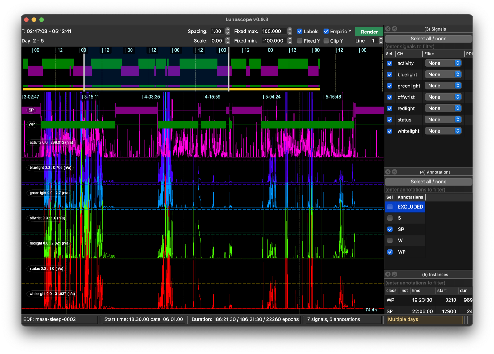
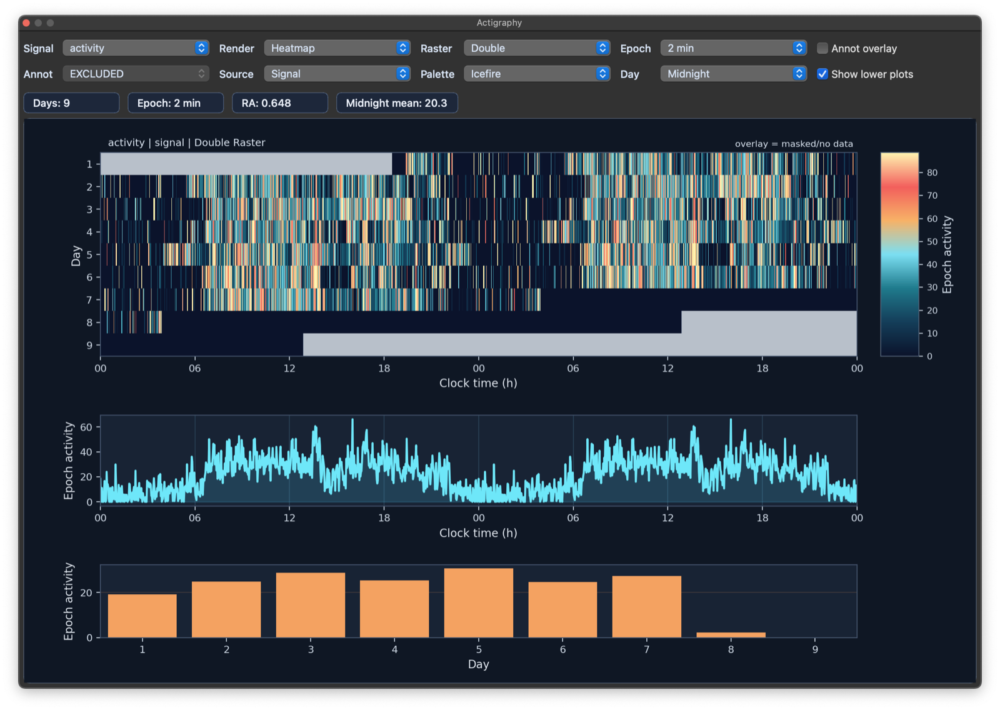
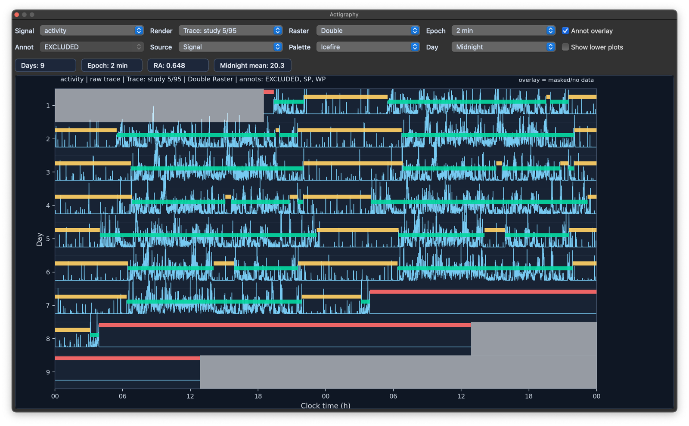
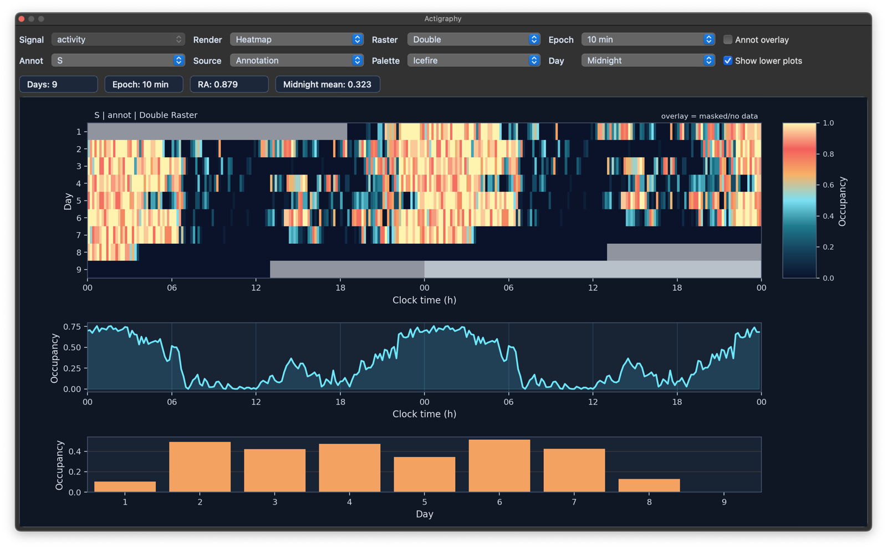

# Multi-day actigraphy mode

Lunascope can switch into a multiday workflow for
recordings that span multiple days.  Although not necessarily the case,
the assumed use-case for this is actigraphy data.  When Luna detects recordings
over 48 hours, it switches to __multiday mode__ (as indicated by the lower right status
message):

The clock times in the main window now also indicate the day
(e.g. above, `3-02:47` indicates early morning of the 3rd day). The
main hypnogram view is relaced with a simpler _sleep period/wake
period_ annotation (purple and green respectively, based on the
annotations `SP` and `WP`, if available) and days are demarked with
lines and noon/midnight markings.

## Main controls

In multiday mode, `Ctrl/Cmd-7` now toggles a special actigraphy/RAR
dock rather than the standard hypnogram dock. The dock is a floating
panel that summarizes activity across days and supports both
signal-driven and annotation-driven displays.

The main settings control the source (`Signal`, `Raw`, or `Annotation`),
epoch duration, day anchor (`Midnight` or `Noon`), raster layout
(`Single` or `Double`), render style, palette, and optional annotation
overlay.

The gray bars at the start and end indicate no data are available for
those periods.  These views can also work with gapped (i.e. EDF+D
format) recordings.

## Render modes

Actigraphy can be rendered as a heatmap (as above) or as trace summaries using
row-level or study-level scaling, with either full-range or more robust
5th/95th percentile summaries.  Here we show the raw traces, also with annotations overlaid
(when the _Annot overlap_ option is selected, any annotations selected in the main _Annotation_ dock
are displayed here, in the example the orange, green and yellow bars reflecting excluded periods, active
and rest/sleep periods):

When annotation-based actigraphy is selected, the signal
chooser is replaced by an annotation chooser:

Figures can be copied to the clipboard or saved as `PNG`, `SVG`, or `PDF`.

## Summary readouts

The dock also reports the number of days, epoch duration, relative
amplitude (RA), and daily mean, updating those values whenever the
display is recalculated.  More metrics can be derived by Luna's
[`ACTIG`](https://zzz.nyspi.org/luna/ref/actigraphy/#actig) command.
Also see the [`DAYS`](https://zzz.nyspi.org/luna/ref/actigraphy/#days)
command and the `dhms` option for [`MASK`](https://zzz.nyspi.org/luna/ref/masks/#mask)
to faciliate manipulating multi-day recordings.

