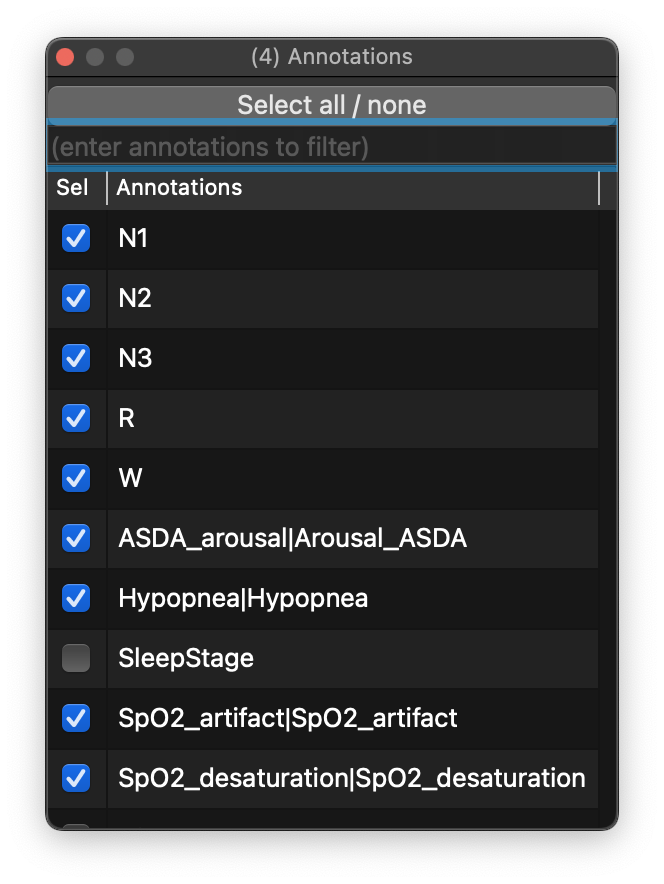
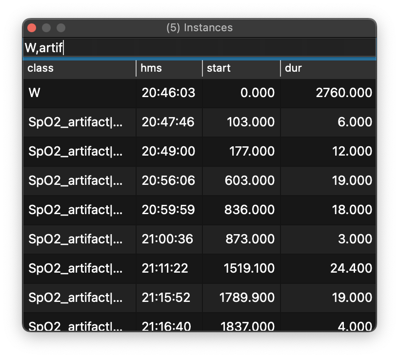

# Annotations

Here, annotations mean any type of event-based data. Events can
represent stages (N1, N2, R, W), respiratory events, or user-defined
marks.

## Annotation classes

The Annotations dock controls which event types are shown in the main
viewer.

{ width="60%" }

As in the Signals dock, you can:

 - toggle between selecting _all_ or _none_

 - filter rows by typing a comma-delimited list of annotations

When an annotation class is selected, its instances appear in the
_Instances_ dock.

## Instances

For selected annotation classes, the _Instances_ dock lists all
instances in clock-time order, along with event onset and duration in
seconds.

{ width="60%" }

Selecting an event moves the main viewer to that point in the record, so
the table doubles as a navigation tool.

You can also filter which instances are displayed in this table (based
on annotation class) by typing a comma-delimited list of terms, as in
the example above that restricts displayed rows to wake (W) and artifact events.

If the source annotations carry per-event metadata, Lunascope also shows
that information in a `meta` column. This preserves key/value text from
the underlying annotation file, making it easier to inspect event-level
details without leaving the GUI.
