# Annotations

Here, _annotation_ means any type of event-based data. Events can
represent stages (N1, N2, R, W), respiratory events, or user-defined
marks.

## Annotation classes

The Annotations dock controls which event types are shown in the main
viewer.

{ width="50%" }

As in the Signals dock, you can:

 - toggle between selecting _all_ or _none_

 - filter rows by typing a comma-delimited list of annotations

When an annotation class is selected, its instances appear in the
_Instances_ dock.

## Instances dock

For selected annotation classes, the _Instances_ dock lists all
instances in clock-time order, along with event onset and duration in
seconds.

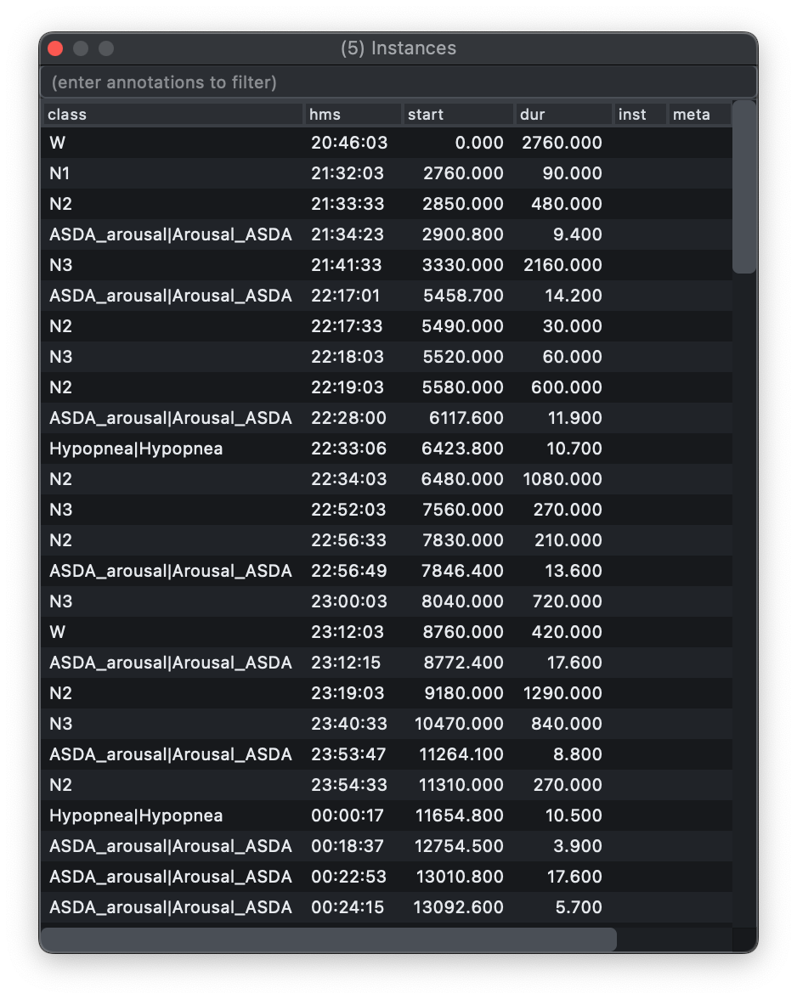{ width="60%" }

Selecting an event moves the main viewer to that point in the record, so
the table doubles as a navigation tool.

You can also filter which instances are displayed in this table (based
on annotation class) by typing a comma-delimited list of terms, as in
the example above that restricts displayed rows to wake (W) and artifact events.

If the source annotations carry per-event metadata, Lunascope also shows
that information in a `meta` column. This preserves key/value text from
the underlying annotation file, making it easier to inspect event-level
details without leaving the GUI.

### Windowing

When you jump to an annotation from the _Instances_ dock, the main
viewer centers on that event. The _W (s)_ control in the top-left
window panel determines how much surrounding context is shown.

In the default `auto` mode, Lunascope chooses a window that is
proportional to the selected annotation duration, so short events stay
visible without losing their local context and long events are shown
with a wider span.

You can also set a fixed window size in seconds. For example, setting
`W (s)` to `60` shows a one-minute window around each selected event:

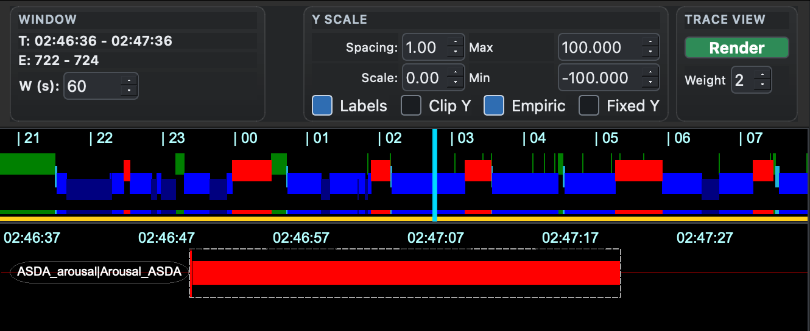

Increasing the value shows more context around the same selected event:

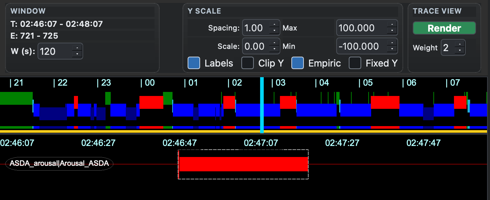

## Annotation editor 

Open the annotation editor with `C-Shift-A`, or from the ___Views___
menu. It has two modes: _Add_ for creating new annotations and _Edit_
for modifying existing ones.

In _Add_ mode, first choose whether you want to capture a selected
interval or a fixed 30-second epoch. Then bind one or more number keys
to annotation classes. A binding can point to an existing class or to a
new class name that you type into the table.

To add an interval annotation, drag across a region in the main viewer:

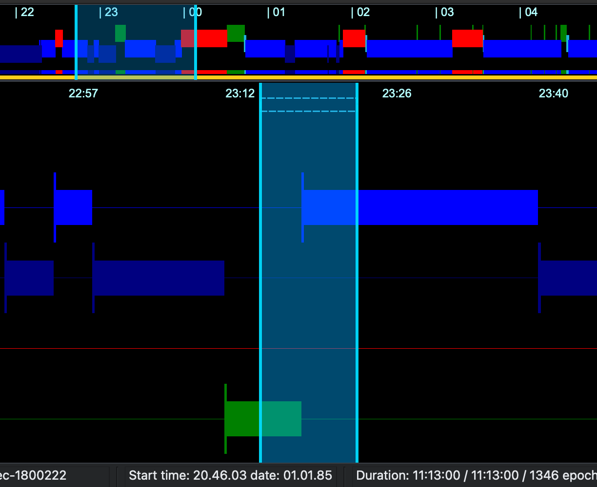{width="60%" }

Then press the bound number key. Lunascope stages the new annotation
but does not immediately write it to the underlying Luna data
structure. The staged addition appears in the editor, where you can
clear it or commit it:

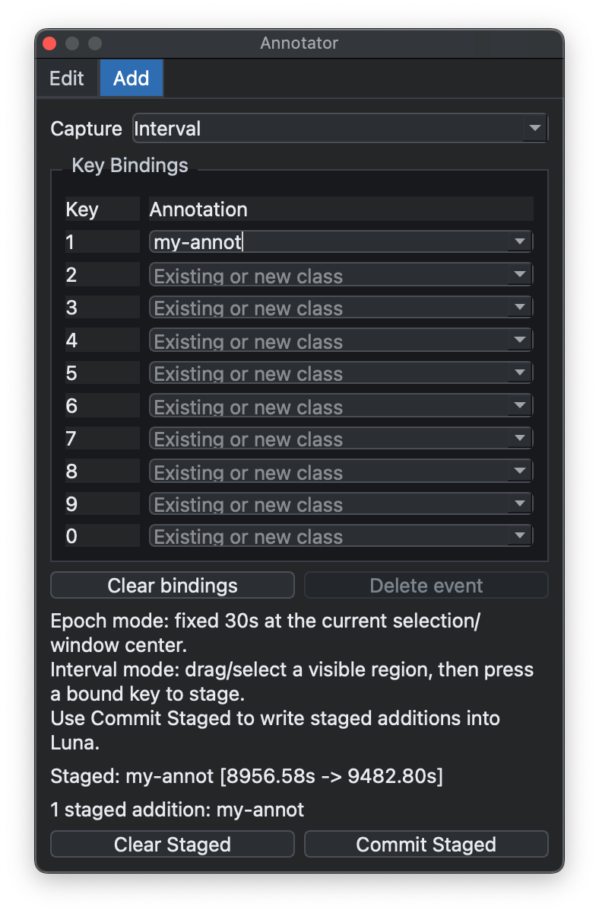{width="60%" }

After committing, the new annotation appears in the viewer as a normal
annotation track:

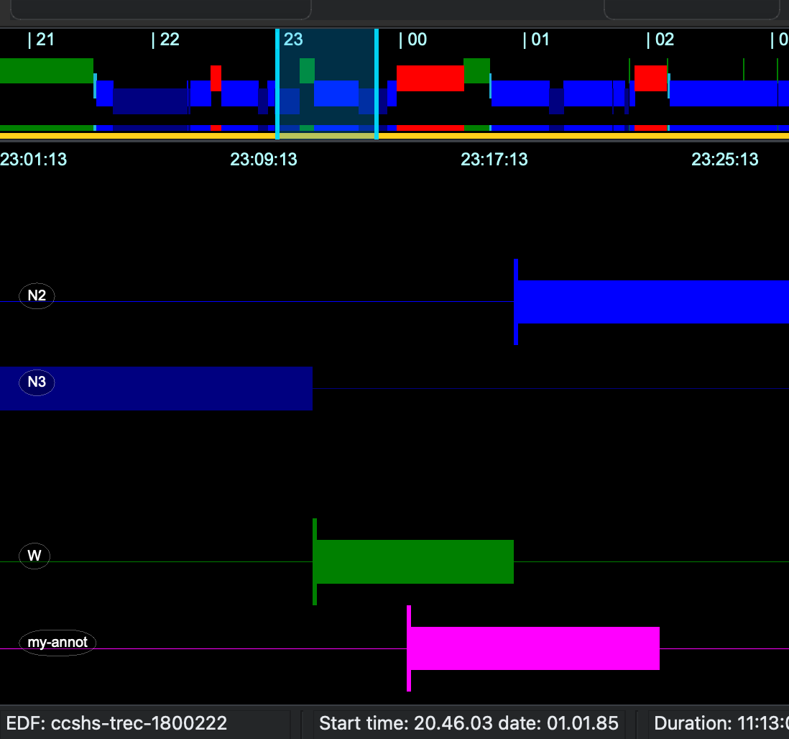{width="60%" }

In _Edit_ mode, select an existing annotation instance from the viewer
or the _Instances_ table. The editor shows its class, instance ID,
start and stop times, channel, and metadata:

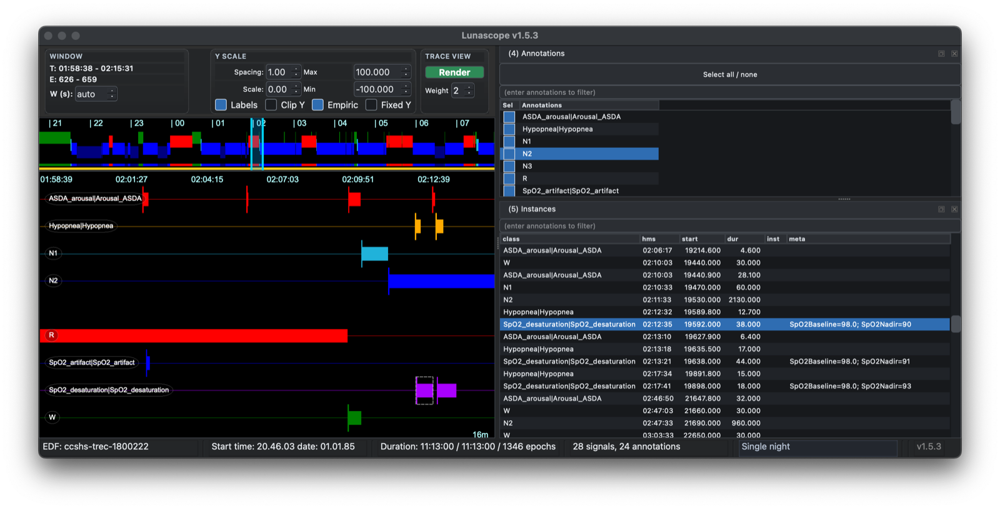{width="100%" }

You can edit the fields directly, for example to adjust timing or
change event metadata, and then choose _Queue Edit_. Queued changes are
marked as pending until you apply them:

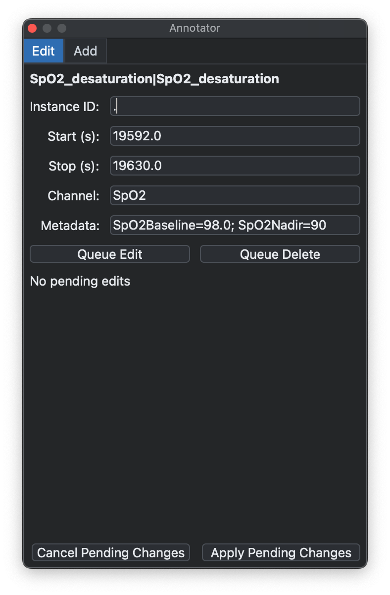{width="50%" }

Pending edits are also indicated in the main interface, so you can
review the affected annotation before committing the change:

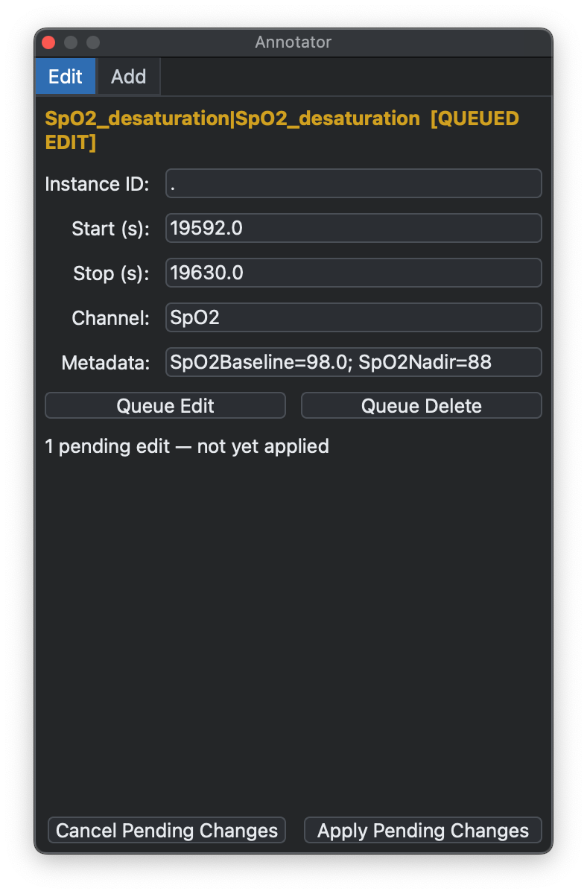{width="50%" }

You can queue deletions in the same way. A queued deletion is displayed
separately from a queued edit, making it possible to inspect pending
changes before they are applied:

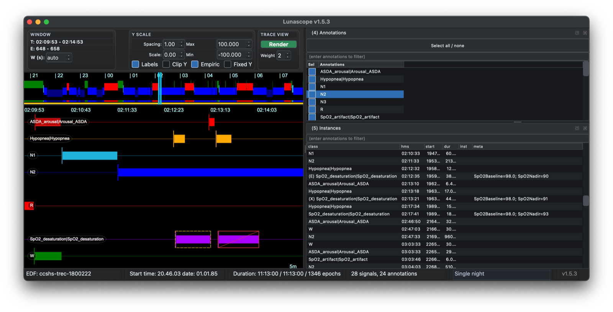{width="100%" }

Finally, choose _Apply Pending Changes_ to write the queued edits or
deletions back into the current Luna annotation set. Until you apply
them, you can cancel the pending changes and return to the original
annotations:

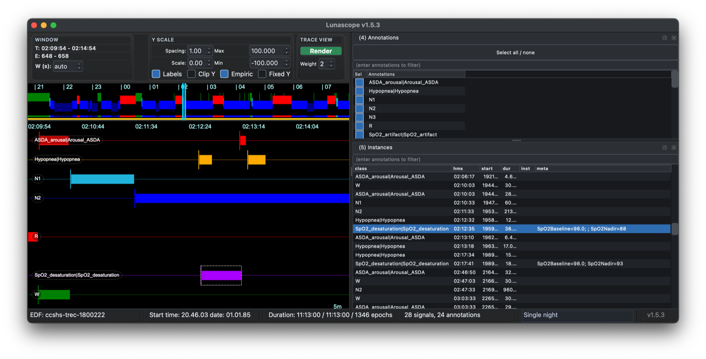{width="100%" }

---

Previous: [Signals](signals.md) | Next: [Spectrograms](spectrograms.md)
