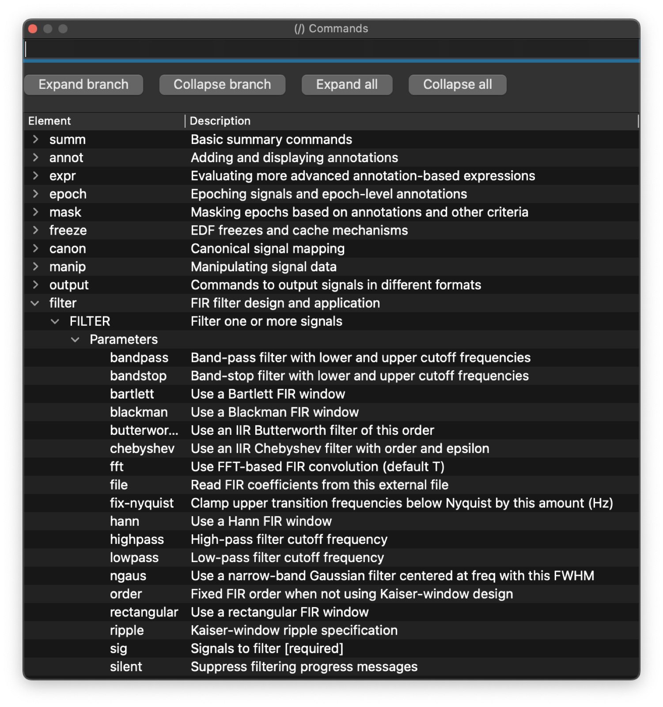

# Command help

Lunascope includes a built-in _Commands_ dock for browsing Luna command
reference information from within the app. It is a reference browser for
Luna commands, parameters, outputs, and variables, not the same thing as
the GUI tooltips/help text for buttons and controls.

Use the `(/) Commands` dock when you want to check which Luna commands are available, which parameters they take, which output tables they produce, and which variables appear in those tables. The tree is organized by domain, command, parameters, outputs, and output variables, and the filter box supports partial matches. It pairs naturally with [Luna Scripts](scripts.md) and the _Console_ / _Outputs_ docks.

