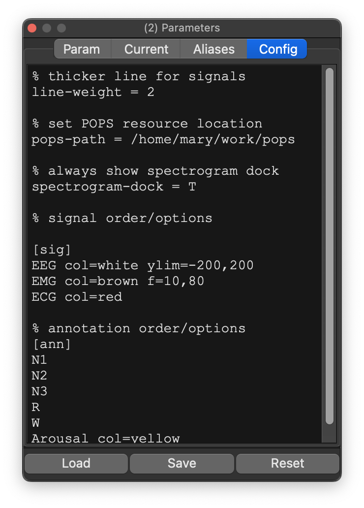
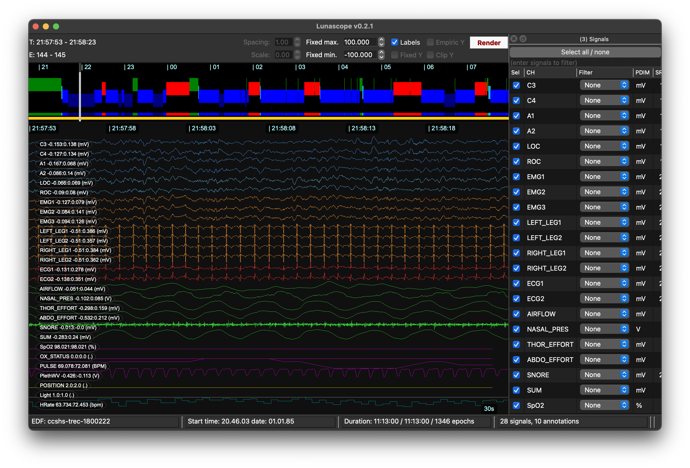
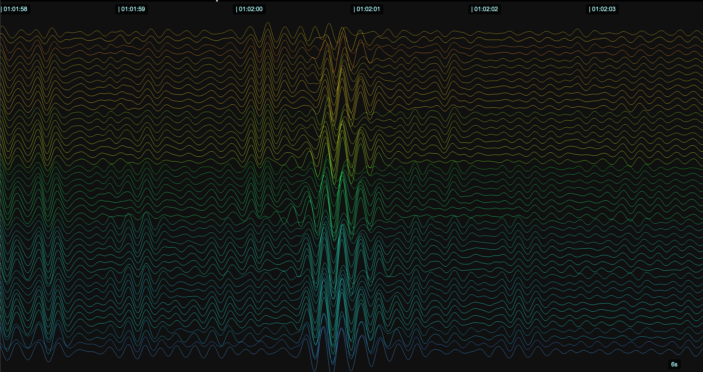

# Configuration files

Configuration files control Lunascope-specific display behavior. They
are separate from Luna parameter files.

They can be used to control:

 - signal and annotation ordering

 - colors for signals and annotations

 - fixed y-axis ranges and reference lines

 - per-signal user filters

 - dock visibility on startup/refresh

 - POPS resource locations

 - output-table export behavior

 - actigraphy day anchoring

 - signal modulation (`sigmod`) rules and palettes

## Applying configurations

You can load a config file on startup:

```bash
lunascope s.lst -c basic.cfg
```

This pre-populates the _Config_ tab in the _Settings_ dock. Config text
can also be edited directly in the GUI and re-applied when a record is
attached or refreshed.

{ width="50%" }

## Grammar overview

A config file is plain text. The parser recognizes these sections:

 - `[par]` for general key/value settings

 - `[sig]` for per-signal display/filter/modulation settings

 - `[ann]` for per-annotation colors and order

 - `[mod]` for reusable signal-modulation definitions

 - `[pal]` for reusable 18-color sigmod palettes

If no section has appeared yet, the parser assumes `[par]`.

Lines beginning with `%` are comments.

Whitespace around `=` is ignored, so `line-weight = 2` and
`line-weight=2` are equivalent.

## Example

```text
% global options
line-weight = 2
spectrogram-dock = T
pops-path = /home/mary/work/pops

[mod]
sp_sigma ch=C3 type=amp f=11,15
sp_phase ch=C3 type=phase f=11,15 bins=pct

[pal]
fire 000000 220000 440000 660000 880000 aa2200 cc4400 ee6600
ff8800 ffaa22 ffcc44 ffdd66 ffee88 fff0aa fff4cc fff8dd fffff0

[sig]
C3 col=white ylim=-200,200 y=0 mod=sp_sigma,fire
C4 col=#4DA6FF f=0.3,35
LOC,ROC col=#66CCFF

[ann]
N1 col=#20B2DA
N2 col=#0000FF
N3 col=#000080
R  col=#FF0000
W  col=#008000
```

## Section details

## `[par]`

`[par]` contains `key=value` settings. These are the parser-visible
options currently used by Lunascope:

| Option | Values | Description |
|---|---|---|
| `show-lines` | `T` / `F` | Show `y=0` reference lines for all channels |
| `line-weight` | numeric | Main-viewer line width |
| `project-dock` | `T` / `F` | Show Project dock |
| `settings-dock` | `T` / `F` | Show Settings dock |
| `signal-dock` | `T` / `F` | Show Signals dock |
| `annots-dock` | `T` / `F` | Show annotation-classes dock |
| `instance-dock` | `T` / `F` | Show annotation-events dock |
| `console-dock` | `T` / `F` | Show Console dock |
| `outputs-dock` | `T` / `F` | Show Outputs dock |
| `mask-dock` | `T` / `F` | Show Masks dock |
| `hypnogram-dock` | `T` / `F` | Show Hypnogram dock |
| `spectrogram-dock` | `T` / `F` | Show Spectrogram dock |
| `table-allow-empty` | `T` / `F` | Allow empty cells when exporting outputs |
| `na-token` | string | Token used for missing cells when empties are not allowed |
| `pops-path` | path | POPS resource folder |
| `pops-model` | string | POPS model label, e.g. `s2` |
| `day-anchor` | `0`-`23` | Default day anchor hour for multiday/actigraphy workflows |

Note the actual keys are `annots-dock` and `outputs-dock`.

## `[sig]`

Each non-empty `[sig]` line starts with one signal label, or a
comma-separated list of signal labels, followed by zero or more fields:

 - `col=<color>` sets the display color

 - `ylim=<low>,<high>` sets fixed y-limits

 - `y=<v1>,<v2>,...` draws reference lines for that signal

 - `f=<low>,<high>` defines the signal's _User_ filter band

 - `mod=<mod_label>,<pal_label>` attaches a sigmod definition and palette

Examples:

```text
[sig]
C3 col=white ylim=-200,200 y=0
EMG f=10,80
LOC,ROC col=#66CCFF
C3 mod=sp_sigma,rwb
```

Signal order in `[sig]` determines signal order in the viewer.

## `[ann]`

Each `[ann]` line starts with one annotation label and can currently
contain:

 - `col=<color>`

Annotation order in `[ann]` determines annotation order in the viewer.

## `[mod]`

`[mod]` defines reusable signal-modulation transforms. These are used at
render time and are the basis of `sigmod` display.

Each `[mod]` line has:

 - a label

 - `ch=<signal>` source channel

 - `type=raw|amp|phase`

 - optional `f=<low>,<high>` for band-limited modulation

 - optional `bins=abs|pct`

Examples:

```text
[mod]
sp_amp   ch=C3 type=amp   f=11,15
sp_phase ch=C3 type=phase f=11,15 bins=pct
raw_c3   ch=C3 type=raw
```

`bins=pct` switches phase/amplitude binning to percentile-based binning.

## `[pal]`

`[pal]` defines custom sigmod palettes.

Each palette must have:

 - one palette label

 - exactly 18 colors

Palettes may span multiple lines. Unlike `[mod]`, `[sig]`, and `[ann]`,
palette continuation does not use `...`; after the first line, you just
continue listing colors on subsequent lines until 18 total colors have
been provided.

Example:

```text
[pal]
mygrad #000000 #111111 #222222 #333333 #444444 #555555 #666666 #777777
#888888 #999999 #aaaaaa #bbbbbb #cccccc #dddddd #eeeeee #f5f5f5 #ffffff #fffacd
```

Lunascope also ships with built-in sigmod palettes. These are useful
when you want to reference a palette by name in `mod=<mod_label>,<pal>`
without defining a custom `[pal]` block.

| Palette | Best for | Description / usage hint |
|---|---|---|
| `rwb` | signed or phase-like modulation | Red-white-blue diverging scheme. Good when positive and negative structure should stand out symmetrically. |
| `gray` | subtle overlays | Monochrome grayscale. Useful when you want sigmod information present but visually restrained. |
| `hot` | amplitude / intensity | Dark-to-bright heat scale. Good for highlighting stronger modulation values. |
| `cool` | amplitude / intensity | Cooler cyan-magenta style gradient. Useful when you want contrast without the usual hot-scale look. |
| `ember` | amplitude / intensity | Dark-to-orange warm palette. Good for sparse bright events on a dark background. |
| `plasma` | amplitude / intensity | High-contrast perceptual gradient. Often a good default for amplitude-style sigmods. |
| `thermal` | amplitude / intensity | Temperature-like progression. Helpful when you want a familiar low-to-high heatmap feel. |
| `aurora` | amplitude / intensity | Cooler multicolor gradient with a more atmospheric look. Good when you want more visual separation across bins. |
| `saturation` | amplitude / intensity | Saturation-driven scale. Useful when you want the strongest bins to feel more vivid than the weaker ones. |
| `rainbow` | cyclic / phase modulation | Full cyclic rainbow palette. Best for phase-like modulation where wrap-around structure matters more than monotonic intensity. |
| `w10` | thresholded percentile bins | Mostly black with a small white high-end band. Good for marking only the top percentile range when using `bins=pct`. |
| `w20` | thresholded percentile bins | Like `w10`, but with a broader white highlighted region. Useful when you want a less selective threshold view. |
| `r10` | thresholded percentile bins | Mostly black with a small red high-end band. Useful for highlighting only the strongest bins while keeping the rest quiet. |
| `r20` | thresholded percentile bins | Like `r10`, but with a broader red highlighted region. Good when `r10` is too sparse. |
| `flux` | custom high-contrast modulation view | A more stylized built-in palette intended for visually distinct sigmod bands rather than a standard heat gradient. |

Practical rules of thumb:

 - use `plasma`, `thermal`, `hot`, or `ember` for amplitude-like sigmods

 - use `rainbow` or `rwb` for phase-like or signed modulation

 - use `w10`, `w20`, `r10`, or `r20` when you want a near-binary thresholded look, especially with `bins=pct`

 - use `gray` when the sigmod should remain secondary to the underlying trace

## Continuation lines

In most cases, it is clearer to keep each `[sig]`, `[mod]`, or `[ann]` entry on a single line. If an entry becomes long, however, `[mod]`, `[sig]`, and `[ann]` can continue onto later lines by starting the continuation line with `...`.

Example:

```text
[sig]
C3 col=white ylim=-200,200
... y=-80,0,80
... mod=sp_sigma,rwb
```

This is parsed as one logical entry for `C3`.

## `sigmod` setup

For a conceptual introduction to signal modulation and when to use it,
see the [Signal modulation](sigmod.md) page.

To configure signal modulation in practice:

1. Define one or more `[mod]` entries.
2. Optionally define a custom `[pal]` palette, or use a built-in palette.
3. Attach the mod to a signal in `[sig]` via `mod=<mod_label>,<pal_label>`.
4. Render the signal view.

Example:

```text
[mod]
sp_sigma ch=C3 type=amp f=11,15

[sig]
C3 col=white mod=sp_sigma,plasma
```

That tells Lunascope to render `C3` normally, but with sigmod coloring
based on the `sp_sigma` modulation and the `plasma` palette.

## Validation rules and common errors

The parser will reject:

 - unknown section names

 - unknown field names inside a section

 - malformed `f=`, `ylim=`, or `mod=` values

 - `[mod]` entries missing `ch=` or `type=`

 - `[sig]` entries referring to unknown mod labels

 - `[sig]` entries referring to unknown palettes

 - `[pal]` entries that do not contain exactly 18 colors

## Examples

### Basic PSG ordering/colors

```text
[sig]
C3 col=#4DA6FF
C4 col=#4DA6FF
LOC col=#66CCFF
ROC col=#66CCFF
EMG1 col=#FF9933
EMG2 col=#FF9933
ECG1 col=#FF3333
ECG2 col=#FF3333

[ann]
N1 col=#0066CC
N2 col=#0066CC
N3 col=#0066CC
R col=#0066CC
W col=#0066CC
```

{width="100%"}


### hd-EEG ordering/colors

```text
[sig]
Fp1 col=#d9bd20
Fpz col=#f2d224
Fp2 col=#fedc25
AF7 col=#d98620
AF3 col=#d98620
AFz col=#f29524
AF4 col=#fe9c25
...
```


