# Explorer

The _Explorer_ is an experimental floating multi-tab dock for
higher-level visual summaries across annotations, staging, signals,
and output tables. Features may be added, changed, or refined over
time.

Open it from the _View_ menu or press `Ctrl/Cmd-E`.

## Tabs

The Explorer includes several tabs:

 - [_Harmonizer_](#harmonizer) : project-wide summaries of signal and annotation naming across the current sample list

 - [_Annotations_](#annotations) : cohort-level summaries and direct overlap analyses across the current sample list or a compiled cache

 - [_Hypnoscope_](#hypnoscope) : summaries of staging across _all individuals_ in the current sample list (or cached)

 - [_Waveforms_](#waveforms) : event-locked visualizations of signals for the current attached recording

 - [_Tables_](#tables) : descriptive summary tables from the current output tables

 - [_Plotter_](#plotter) : plots of the current [output dock](scripts.md#output-dock)

 - [_Assoc_](#assoc) : group-level association workflows for phenotypes, signals, and covariates

 - [_Filter Design_](#filter-design) : interactive filter-design and response-plotting tools

 - [_Topo_](#topo) : experimental topographic displays for channel-level summaries

## Harmonizer

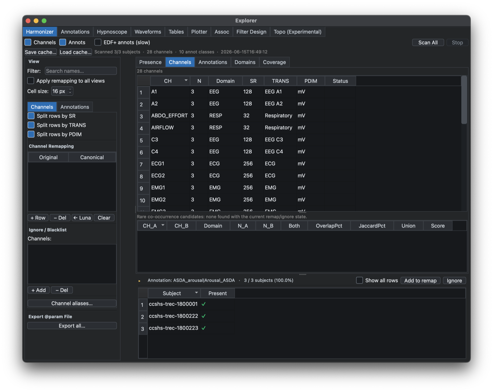{ width="90%" }

The _Harmonizer_ tab provides project-wide summaries of signal and
annotation naming across the current sample list. It is intended to
help identify inconsistent labels before running cohort-level analyses.

## Annotations 

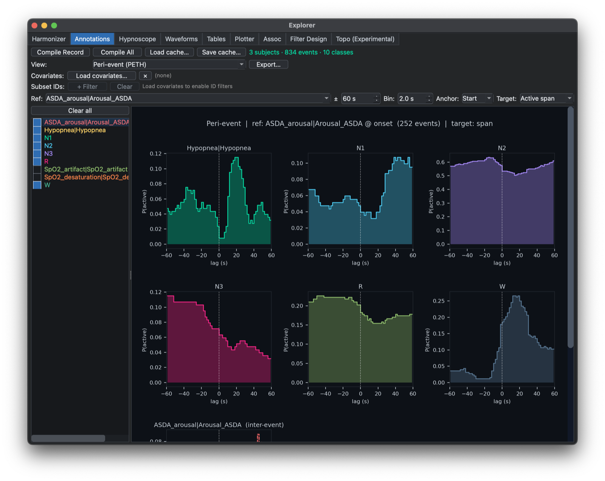{ width="100%" }

The _Annotations_ tab compiles annotations across the whole sample
list and supports several cohort-level views:

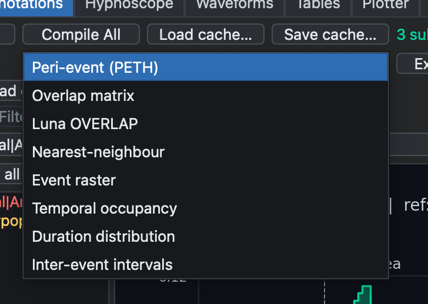{ width="50%" }

In addition to compiling across the project, the tab can choose a
reference annotation class and adjust the analysis window, histogram
bin width, and raster gap.

The _Annotations_ tab supports compiled-cache save/load and figure
export.  For compiled cohort caches, Lunascope can also merge an
external covariate table that contains an `ID` column. Low-cardinality
columns from that table can then be used as ID-level filters, making
it easier to restrict the cohort to a subgroup before plotting or
computing summary statistics.

##### OVERLAP 

The _Luna OVERLAP_ mode exposes the native Luna `OVERLAP` analysis from
within the Explorer. You provide the `OVERLAP` arguments directly in a
free-text box, and choose whether to run on the _current subject_ or on
a _compiled cohort_ timeline assembled from the current cache or sample
list. In compiled-cohort mode, Lunascope concatenates individuals onto
a non-overlapping synthetic timeline and inserts subject-boundary
markers so background-restricted permutations still operate within
person.

All returned Luna output tables are pushed to the standard _Outputs_
dock. This makes it possible to inspect the full `OVERLAP` result set,
including the usual seed-seed and seed-other summary tables, while
keeping the setup inside the annotation workflow.

## Hypnoscope

{ width="90%" }

The _Hypnoscope_ tab compiles staging annotations across the full
sample list and renders a cohort hypnogram grid.

It supports project-wide compilation, alignment by _Clock time_,
_Elapsed recording_, or _Elapsed sleep_, and sorting by alphabetical
order, clock start, sleep efficiency, TST, or sleep-onset latency. This
is intended as a compact cohort-level overview of staging timing and
structure.

The _Hypnoscope_ tab supports staging-cache save/load and figure export.

## Waveforms

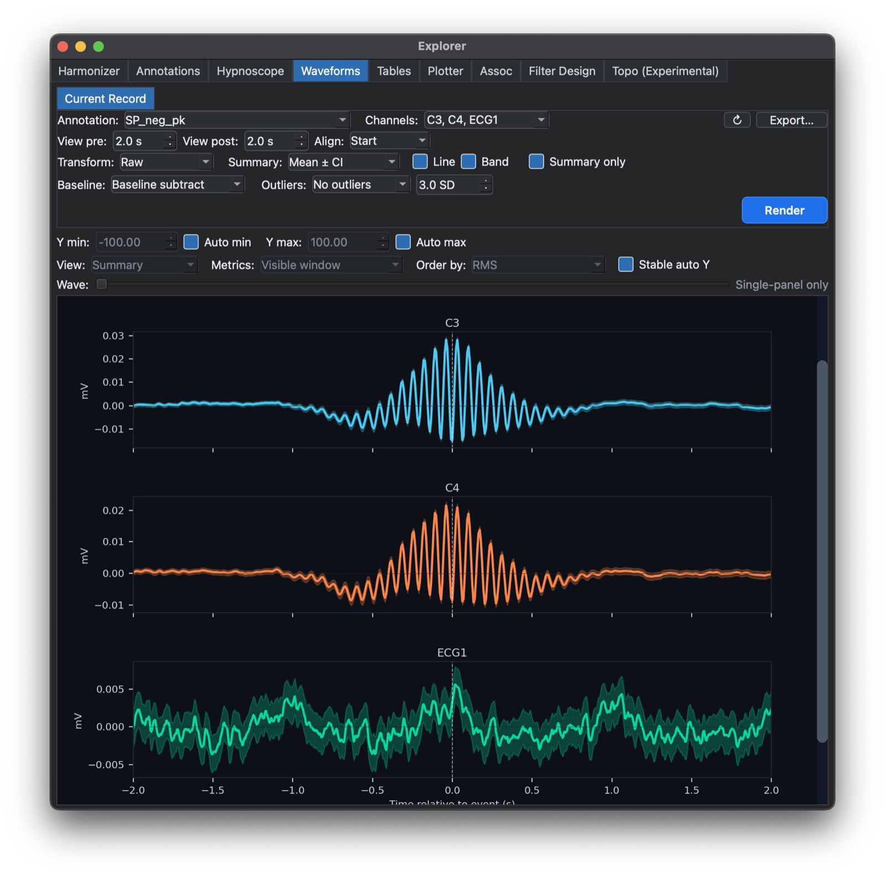{ width="95%" }

The _Waveforms_ tab extracts peri-event signal windows from the
currently attached record. You choose an annotation class, one or more
EDF channels, pre-event and post-event windows, alignment to event
_Start_, _Midpoint_, or _Stop_, and whether to baseline-subtract each
extracted trace.  The resulting display overlays individual traces
together with a mean trace and confidence interval summary.

For single-record analyses, the tab also supports optional outlier
handling on extracted traces. Outlying windows can either be left as
is, winsorized, or removed entirely using a user-selected SD-based
threshold.

## Tables

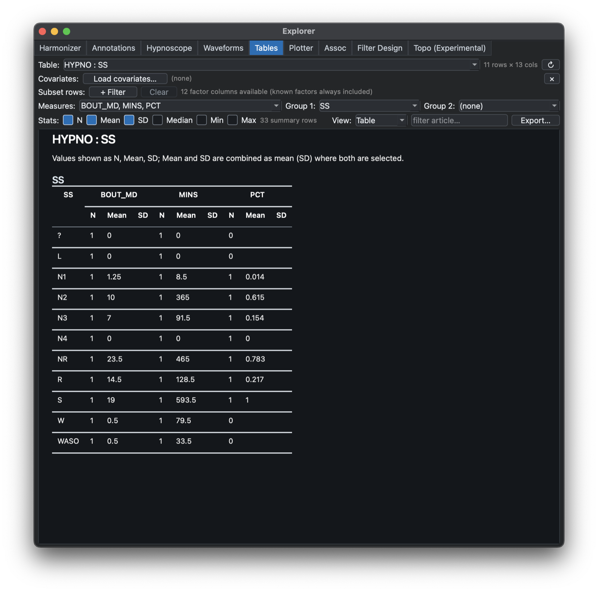{ width="95%" }

The _Tables_ tab summarizes numeric columns from output tables. It
supports selecting one or more measures, optional grouping by one or
two factors, row filters, covariate-file merging, selectable summary
statistics, and either grid-style or publication-style table output, as below.

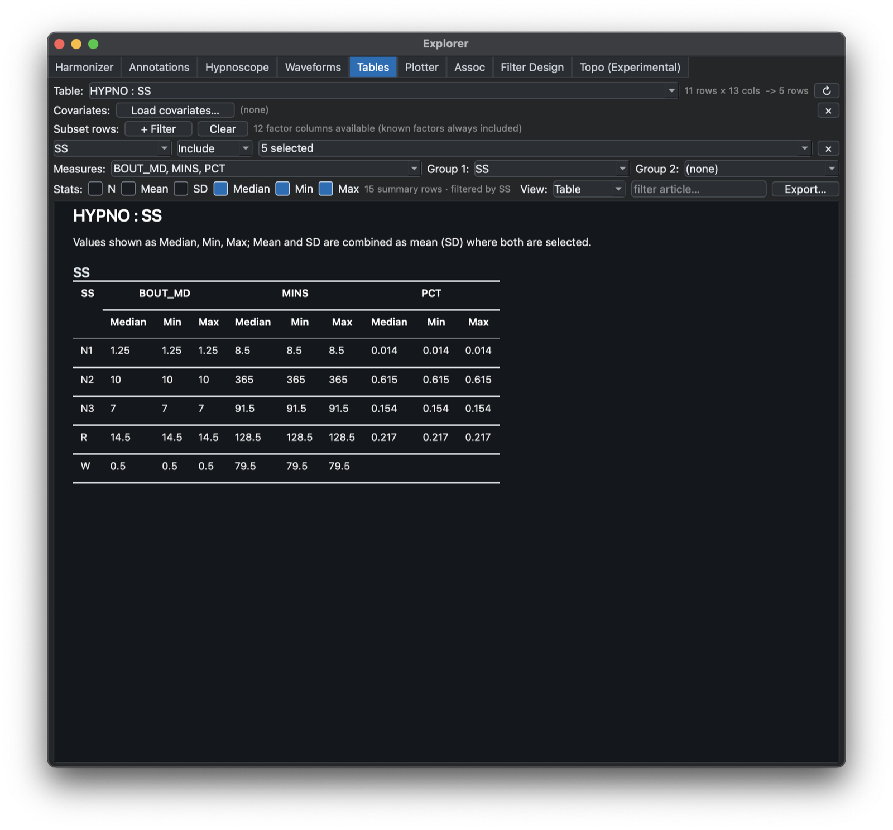{ width="95%" }

## Plotter

{ width="90%" }

The _Plotter_ tab turns output tables from the _Outputs_ dock into
figures. It supports auto-selected or explicit plot types (`scatter`,
`line`, `bar`, `histogram`, `box`), X and Y variable selection,
optional log scaling on either axis, two grouping variables, and
either _Overlay_ or _Separate_ display for each grouping variable. It
can also merge an external TSV/CSV covariate file as long as that file
contains an `ID` column.

A row-subsetting control can be used to filter the current output table
before plotting. This is useful when a Luna output contains multiple
strata or analysis passes but only a subset should be shown in the
figure.

When an X-axis factor looks numeric, the Plotter sorts it numerically
rather than lexicographically. This avoids orderings such as `1, 10,
11, 2, 3` when plotting epoch numbers, bins, lags, or similar indexed
variables.

Note, when first loading a stratified table, for example by channel,
the initial plot will combine all strata: here channels are
interleaved effectively:

{ width="90%" }

Selecting the `CH` to be the _Group 1_ stratifier yields a plot with
two lines, one per unique value of `CH` (as above). You can also
select _Separate_ instead of _Overlap_ to get multi-panel
representations of the same data:

{ width="90%" }

## Assoc

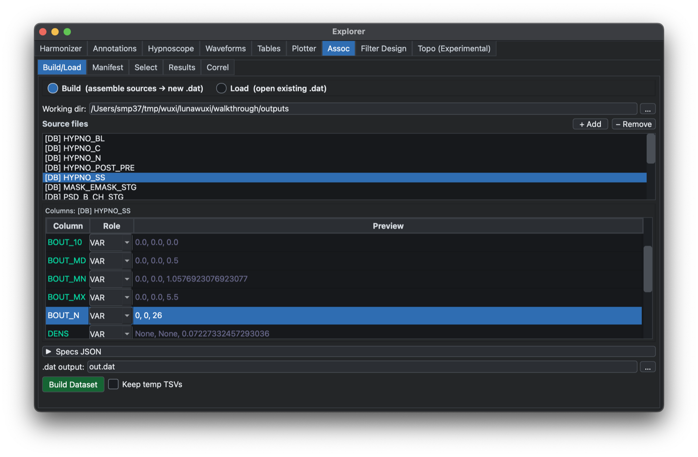{ width="90%" }

The _Assoc_ tab is for group-level association workflows that combine
phenotypes, signal-derived measures, and covariates. It is intended for
project-level analyses after relevant output tables and covariate data
have been assembled. This is primarily an interface to Luna's [GPA command](https://zzz-luna.org/luna/ref/assoc/#gpa).

The image above shows how saved outputs ( e.g. TSV files with
covariate data, or previously saved _Outputs_ docks) can be
selected. Each table is previewed; individual tables can be dropped.
If loading from saved Outputs docks, Lunascope will know which
variables are _factors_ (`FAC`, e.g. channel or frequency or sleep
stages, etc) and which are the core values ( e.g. here `BOUT_N` etc).

Having selected __Build Dataset__, a binary `.dat` file will be generated and a _Manifest_ shown: here all
values are expanded into a _wide-formatted_ dataset.

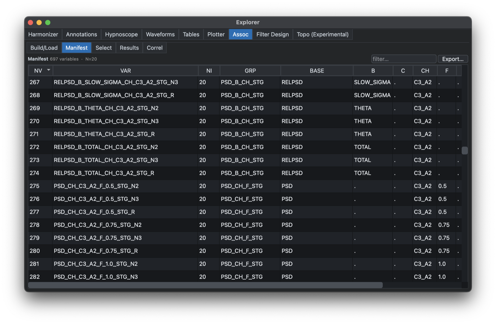{ width="90%" }

That is, if `BOUT_N` is defined for `N1`, `N2`, `N3`, etc, the generated dataset will have variables named `BOUT_N_SS_N1`, `BOUT_N_SS_N2`, `BOUT_N_SS_N3` etc.
The manifest (which can be saved) provides a convenient linking of long-to-short variable names and factor/level strata information.

Next, one can __Select__ which variables are dependents (Y), predictors (X) or covariates (Z), with this tab: 

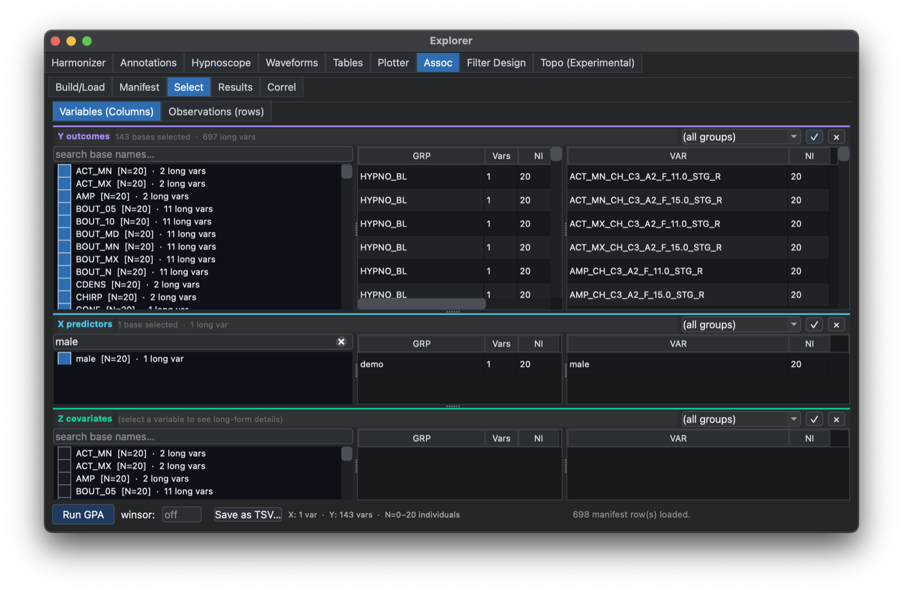{ width="90%" }

This tab also allows for selection of individuals, e.g. to specify subsets of the sample for analysis (e.g. here requiring at least 300 minutes of total sleep time (`TST`):

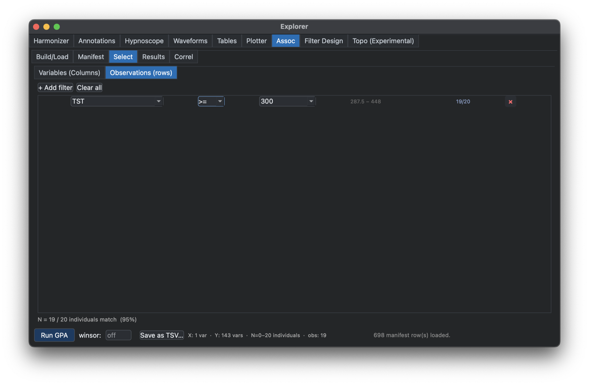{ width="90%" }

Having selected the variables and individuals for analysis, clicking `Run GPA` should bring up this view, with a table showing the results for each X/Y variable pair,
and a volcano plot at the bottom: 

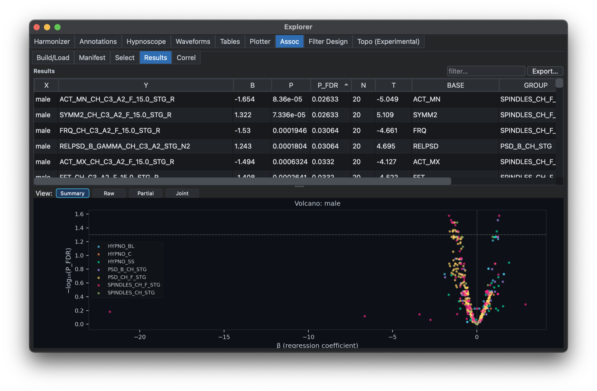{ width="90%" }

Clicking on a single row should bring up a scatter plot or box plot (depending on whether X is binary or continuous): 

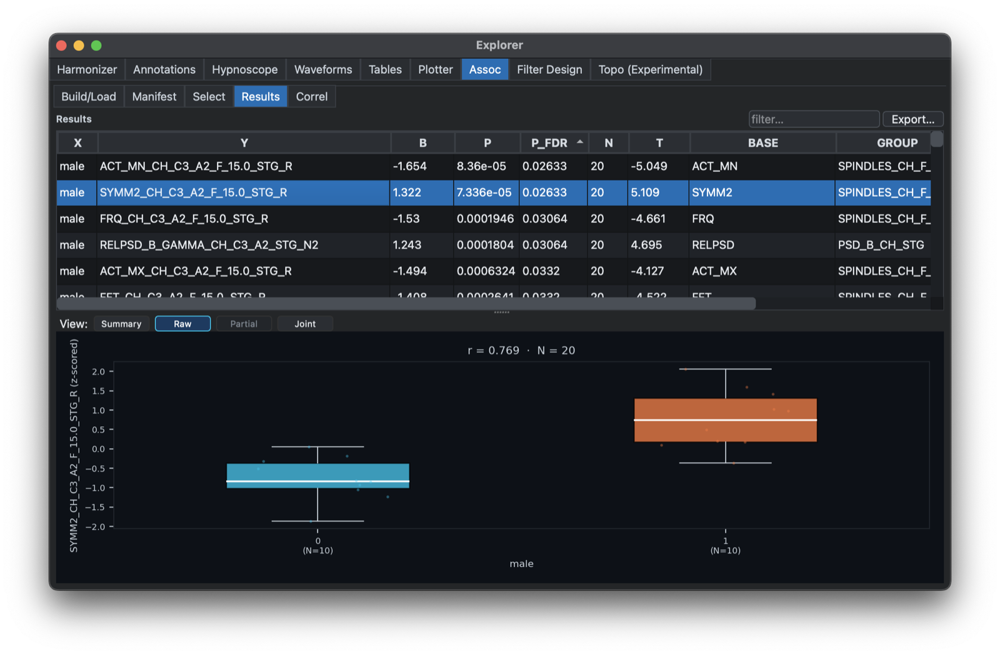{ width="90%" }

Selecting _Joint_ allows for the creation of joint models, where multiple sleep metrics can be jointly modelled (note: here the model is reversed, such that X is
the outcome in either a linear or logistic regression, allowing for one or more sleep metrics (conventionally denoted _Y_ here) along with covariates.  For example,
here we ask whether REM density (minutes per hour of recording time) is associated with male sex (X=1), controlling for total persistent sleep time:

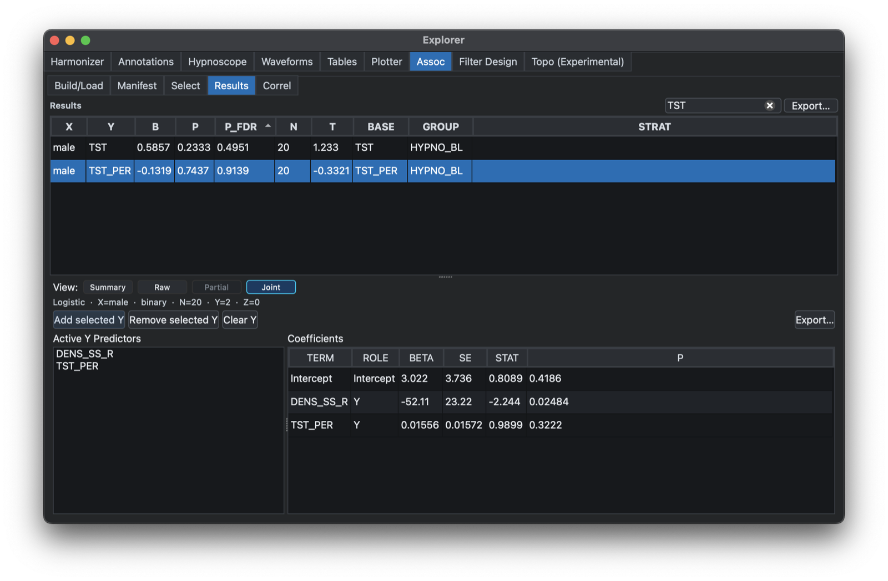{ width="90%" }

Finally, the _Correl_ tab allows one to select a seed variable and see
a quick (unconditional) plot of which other variables correlate
strongly:

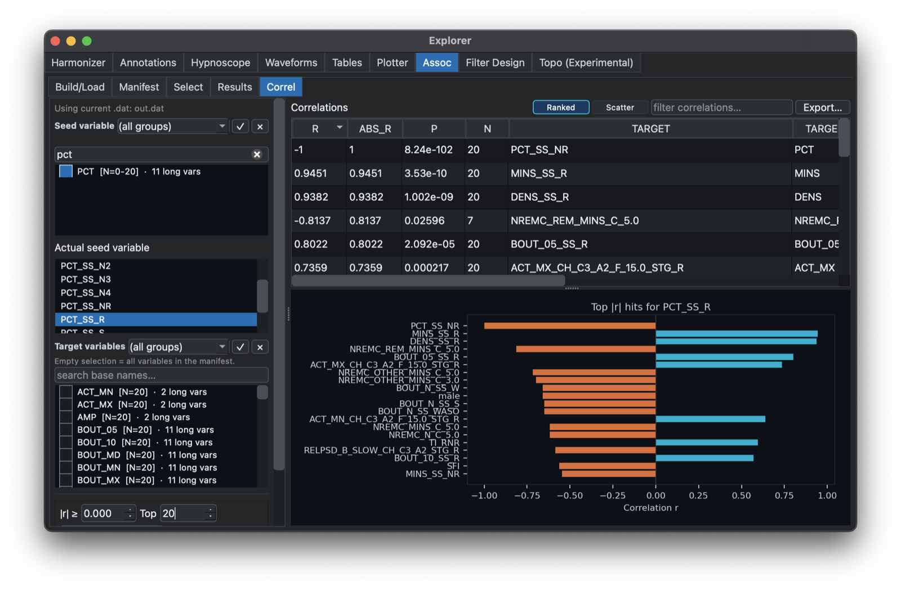{ width="90%" }

## Filter Design

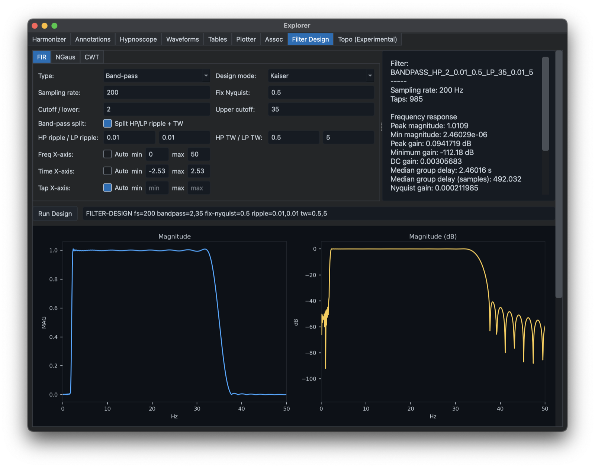{ width="90%" }

The _Filter Design_ tab builds and visualizes filter specifications
before they are used in scripts or configuration files. It supports
FIR, CWT, and narrow Gaussian designs, with response plots, command
text.

## Topo

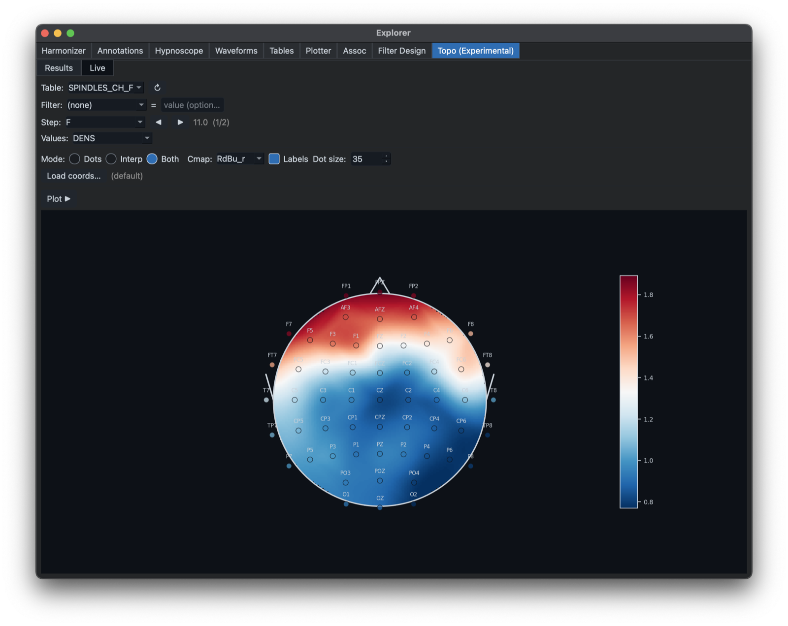{ width="100%" }

The _Topo_ tab provides experimental topographic displays for
channel-level summaries. It is intended for visualizing spatial
patterns across compatible high-density EEG channel layouts.

Inputs are selected from the current _Outputs_ dock (note that one can load any TSV into the _Outputs_ dock too,
as well as capturing Luna command evaluations there).  Above, we plot spindle density with a `Step` that looks at the `F`
variable (11 or 15 Hz, for slow and fast spindles, respectively -- see Luna tutorial for more examples and context).  Here
are the values for fast spindles -- i.e. clicking the right arrow to get 15:

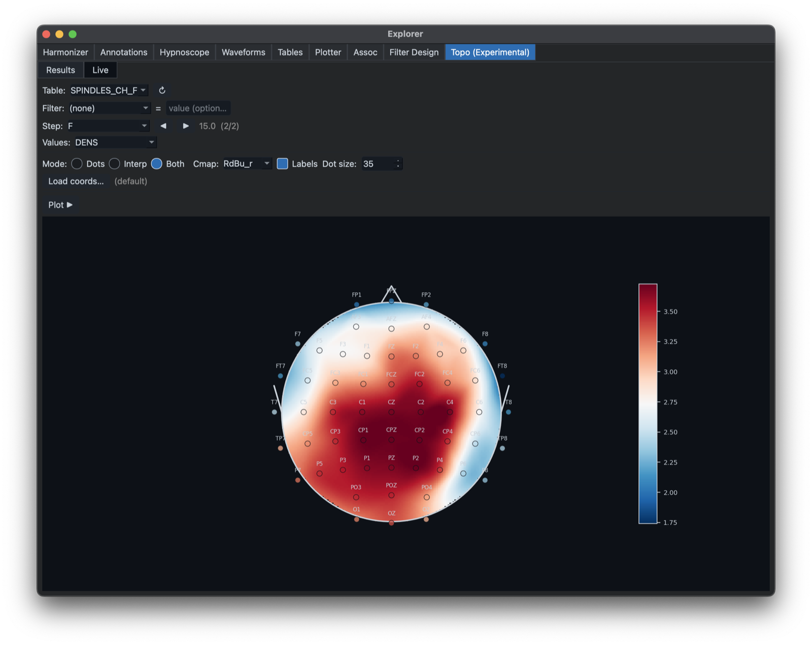{ width="100%" }

One can alter the appearance, for example removing the interpolated component: 

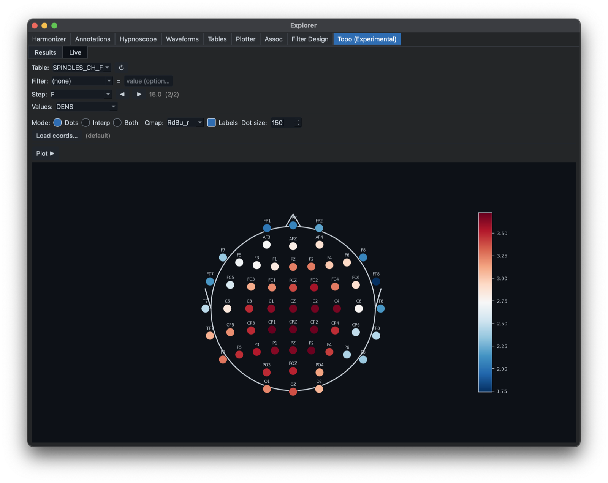{ width="100%" }

Finally, there is an __experimental__ player that can show spectral
power or signal RMS continuously vary over time, by pressing the
__Play__ button.

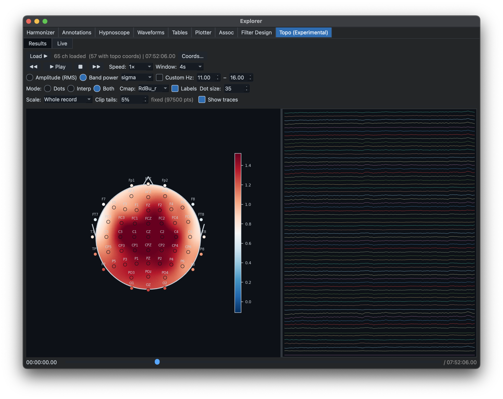{ width="100%" }

---

Previous: [Actigraphy](actig.md) | Next: [Configuration](config.md)
