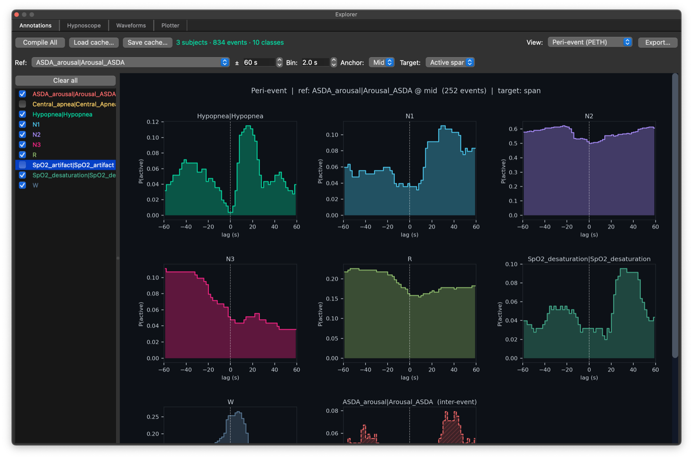
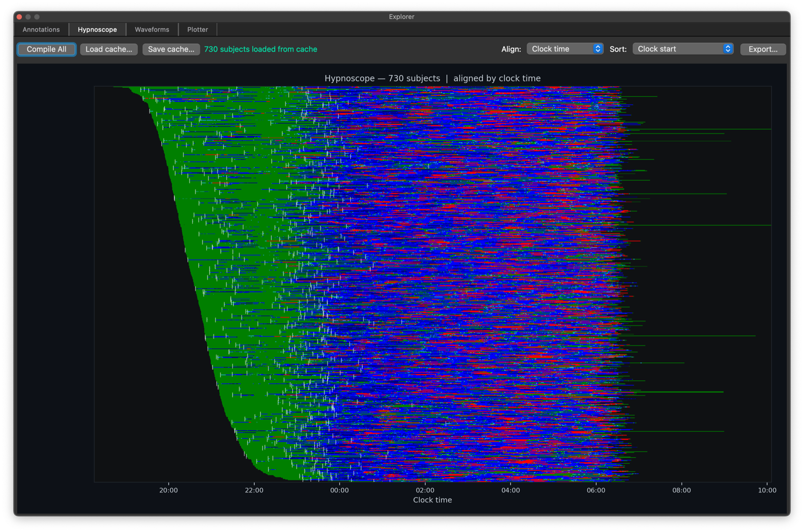
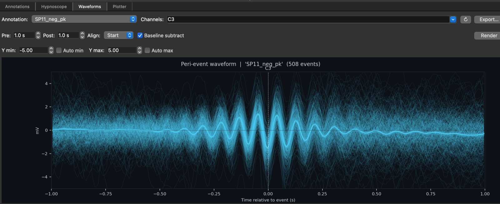
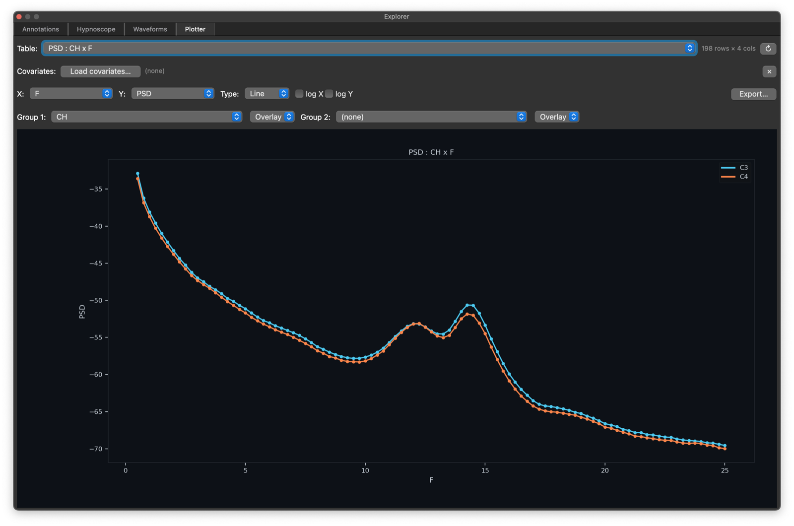
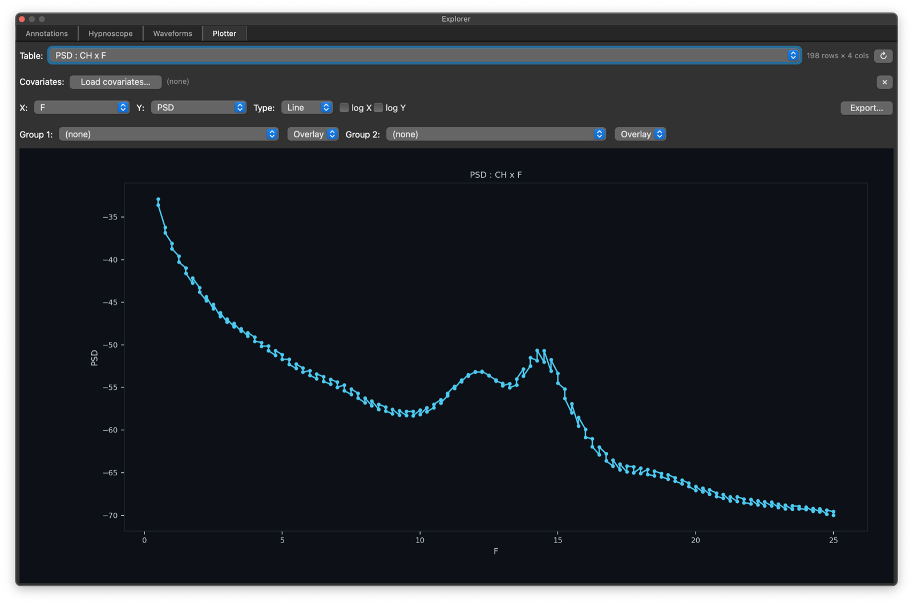
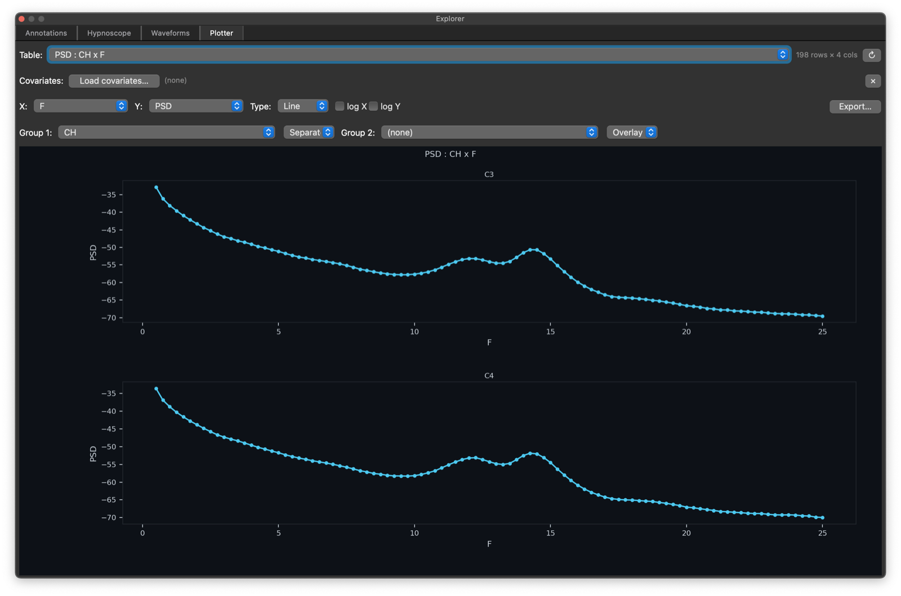

# Explorer

The _Explorer_ is an experimental floating multi-tab dock for
higher-level visual summaries across annotations, staging, signals,
and output tables.  Features may be added, changed or improved.

Open it from the _View_ menu or press `Ctrl/Cmd-E`.

## Tabs

The Explorer currently has four tabs:

 - _Annotations_ : summaries annotations across _all individuals_ in the current sample list (or cached)

 - _Hypnoscope_ : summaries of staging across _all individuals_ in the current sample list (or cached)

 - _Waveforms_ : event-locked visualizations of signals for the current attached recording

 - _Plotter_ : simple plots of the current [output dock](scripts.md#output-dock)

## Annotation Explorer

{ width="90%" } 

The _Annotations_ tab compiles annotations across the whole sample
list and supports several cohort-level views:

 - _Peri-event (PETH)_ (example above) 

 - _Overlap matrix_

 - _Nearest-neighbour_

 - _Event raster_

 - _Temporal occupancy_

 - _Duration distribution_

 - _Inter-event intervals_

It also supports compiling across the project, saving or loading
caches, exporting figures, choosing a reference annotation class, and
adjusting the analysis window, histogram bin width, and raster gap.

## Hypnoscope

{ width="90%" }

The _Hypnoscope_ tab compiles staging annotations across the full
sample list and renders a cohort hypnogram grid.

It supports project-wide compilation, cache save/load, figure export,
alignment by _Clock time_, _Elapsed recording_, or _Elapsed sleep_,
and sorting by alphabetical order, clock start, sleep efficiency, TST,
or sleep-onset latency. This is intended as a compact cohort-level
overview of staging timing and structure.

## Waveforms

{ width="90%" }

The _Waveforms_ tab extracts peri-event signal windows from the
currently attached record. You choose an annotation class, one or more
EDF channels, pre-event and post-event windows, alignment to event
_Start_, _Midpoint_, or _Stop_, and whether to baseline-subtract each
extracted trace.

The resulting display overlays individual traces together with a mean
trace and confidence interval summary.

## Plotter

{ width="90%" }

The _Plotter_ tab turns output tables from the _Outputs_ dock into
figures. It supports auto-selected or explicit plot types (`scatter`,
`line`, `bar`, `histogram`, `box`), X and Y variable selection,
optional log scaling on either axis, two grouping variables, and
either _Overlay_ or _Separate_ display for each grouping variable. It
can also merge an external TSV/CSV covariate file as long as that file
contains an `ID` column.

Note, when first loading a stratified table - e.g. here by channel,
the initial plot will combine all strata: here channels are
inter-leaved effectively:

{ width="90%" }

Selecting the `CH` to be the _Group 1_ stratifier, yields a plot with
two lines, one per unique value of `CH` (as above). You can also
select _Separate_ instead of _Overlap_ to get multi-panel
representations of the same data:

{ width="90%" }

## Caches and exports

The cohort-level _Explorer_ tabs are designed to avoid repeated
recompilation: the _Annotations_ tab can save and load compiled
annotation caches, and the _Hypnoscope_ tab can do the same for
staging caches. All tabs also provide figure export for reports and
presentations.
