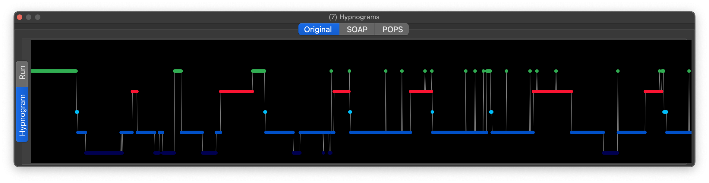
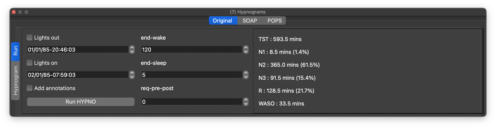
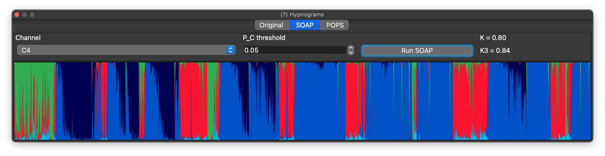
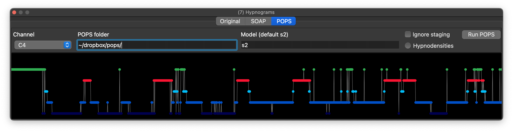
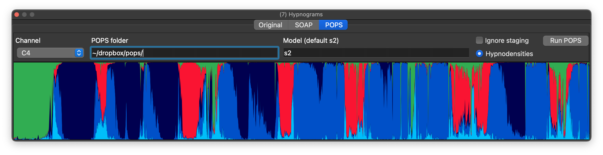
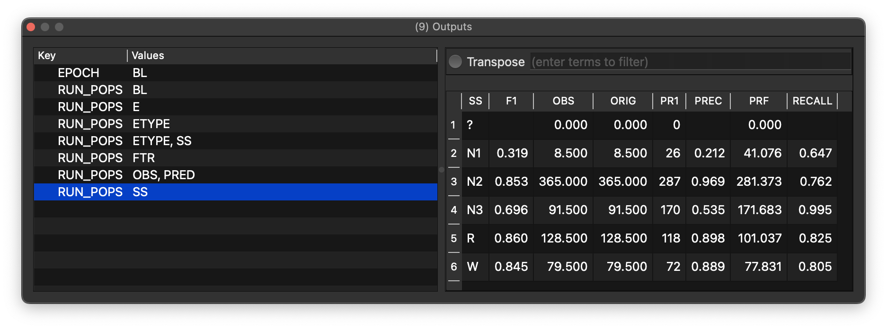

# Hypnograms

Hypnograms summarize sleep stages across time. If valid staging annotations are present, a hypnogram appears both in the main signal view and in the hypnogram dock. Stages must map to `N1`, `N2`, `N3`, `R`, `W`, and `?`; if other labels are used, they can be `remap`ped via a [parameter file](parameters.md).

This tab also reports simple summary statistics such as stage durations and WASO. Lights out/on times can be adjusted before recalculating the output with _Run HYPNO_.

## Staging evaluation (SOAP)

As [described here](https://zzz-luna.org/luna/ref/soap/), SOAP evaluates
signal/staging consistency. When staging data are present, select a
channel and press _SOAP_ to generate kappa coefficients and a
SOAP-hypnodensity plot:

## Automated Staging (POPS)

Lunascope can download the POPS resource bundle for you. Use either:

 - _Project / Download POPS Resources..._

 - the _Get..._ button beside the POPS path field

This downloads the current POPS bundle, extracts the model files,
updates the _POPS folder_ field to the resolved model directory, and
remembers that location for later launches.

If you prefer, you can still download and expand the [POPS resource
.zip](http://zzz.nyspi.org/dist/luna/pops.zip) manually and point the
_POPS folder_ box to that location yourself, or use a [configuration
file](config.md) to set [`pops-path`](config.md#par).

As [described here](https://zzz-luna.org/luna/ref/pops/), POPS performs
automatic sleep staging and hypnodensity visualization.

Select one or more suitable EEG channels, point Lunascope to the downloaded POPS model files, and run _POPS_. This produces a hypnogram of predicted stages. At present only the single-EEG `s2` model is supported in this convenience interface.

If you select multiple comparable EEG channels, they are treated as equivalent inputs for prediction. In that mode POPS predicts from each candidate channel separately and then uses the most confident prediction for each epoch. See the Luna [POPS prediction](https://zzz.nyspi.org/luna/ref/pops/#pops-prediction) documentation for the underlying details.

You can switch between this view and the hypnodensities with the _Hypnodensity_ option:

There is also an option to ignore existing staging. In that mode kappa statistics are not computed, but all epochs are included; otherwise epochs marked as unknown (`?`) are excluded from automated staging. A fuller set of POPS metrics is written to the primary [_Output_ dock](scripts.md); here the stage-specific metrics are shown:

POPS saves new annotations (`N1`, `N2`, and so on, or if staging already exists, `pN1`, `pN2`, and so on to indicate predicted stage). These annotations can then be selected from the [Annotations table](annotations.md), used in [Masks](masks.md), or incorporated into other [Luna scripts](scripts.md).

If you need different options, you can invoke `RUN-POPS` or `POPS` directly from the [_Console_](scripts.md) instead of this convenience interface.
