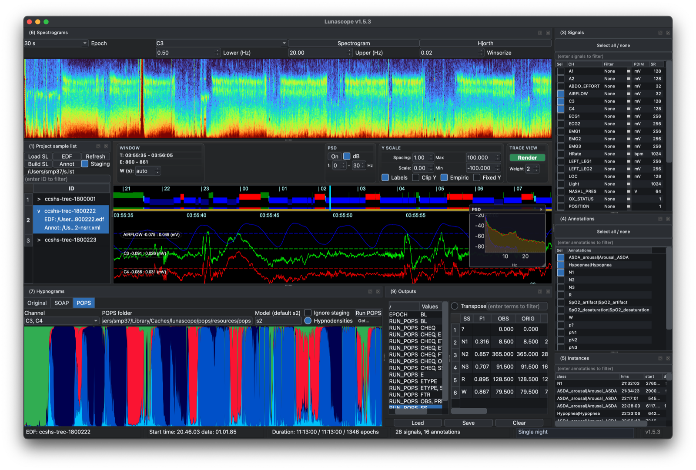
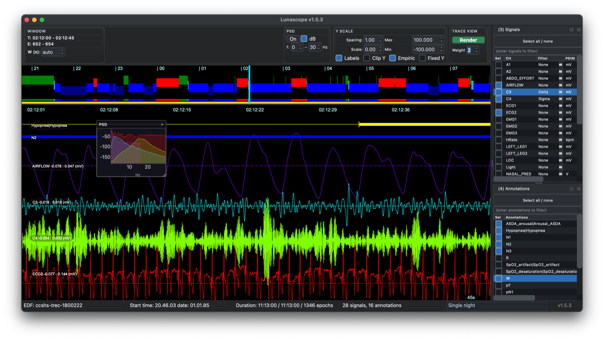
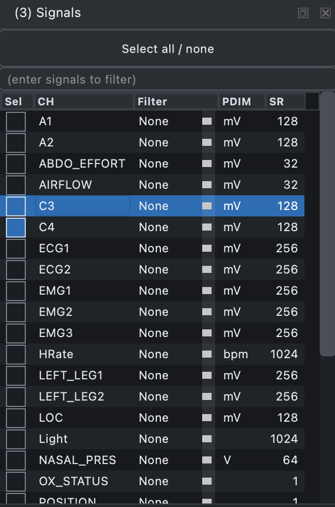
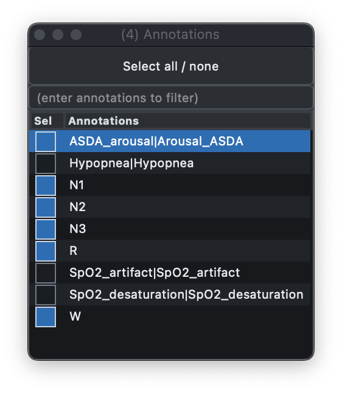
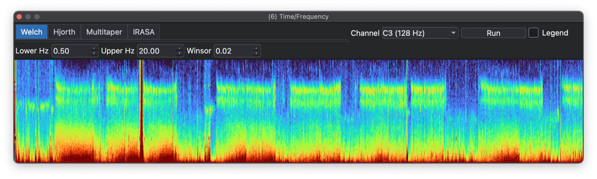
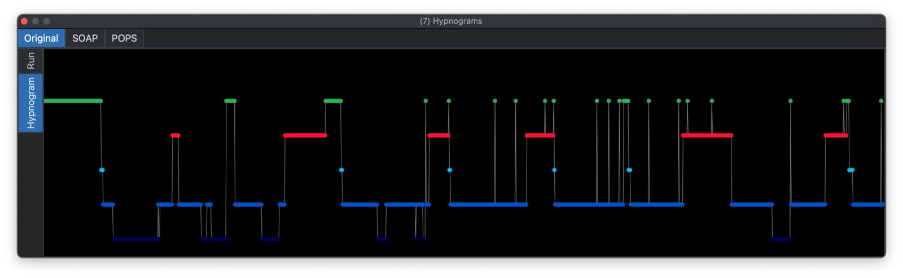
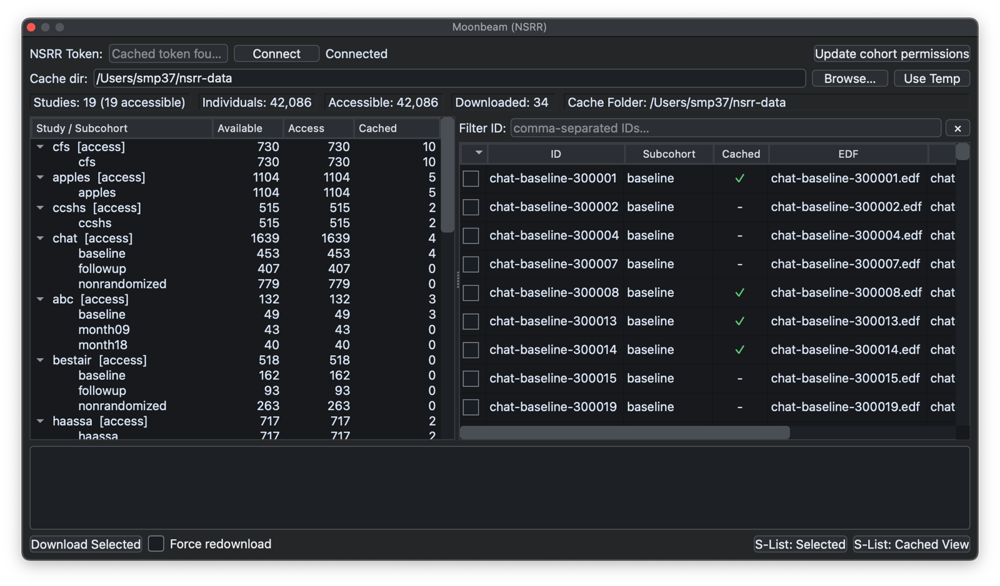
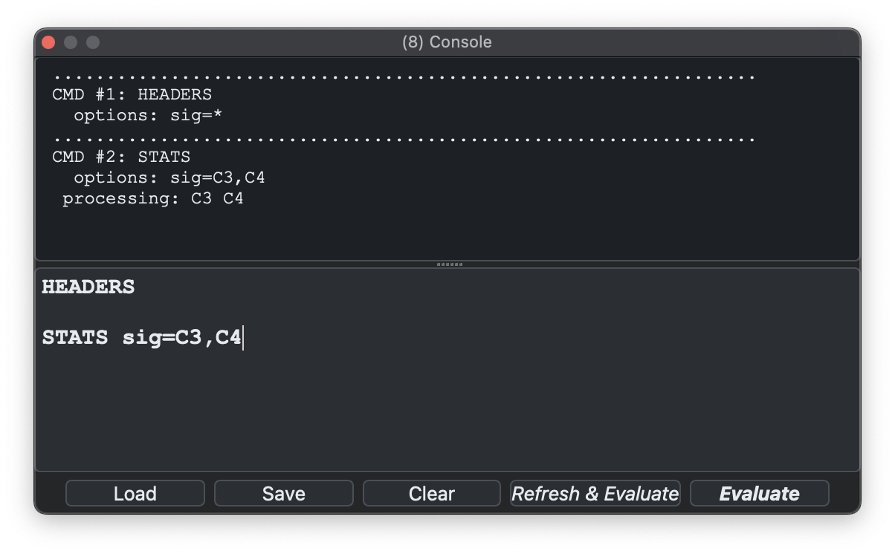
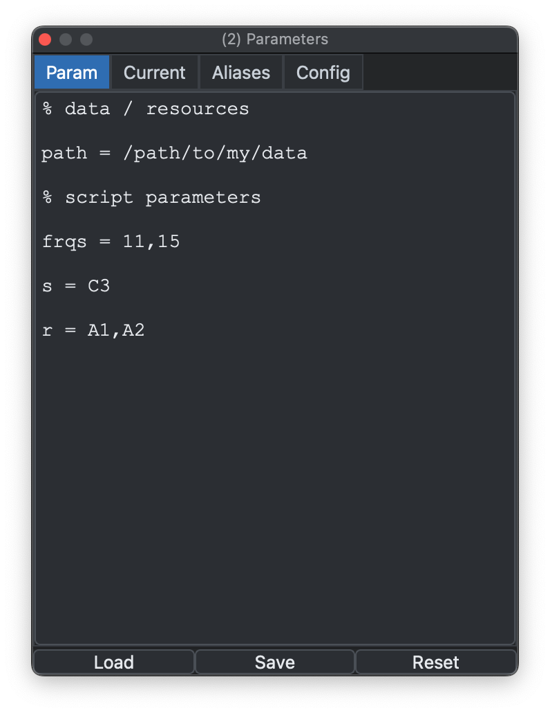
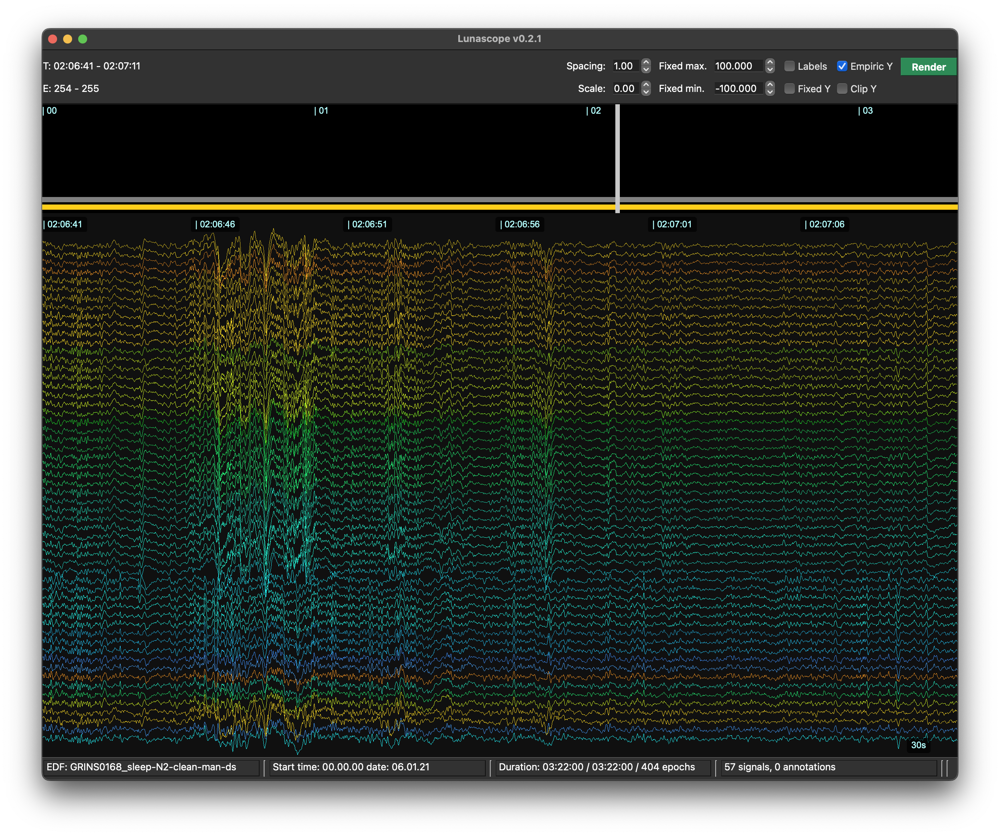

# Lunascope v1.6.4

Lunascope is a desktop interface to the [Luna
suite](https://zzz.nyspi.org/luna): an interactive viewer, scripting
front end, and packaged way to work with the underlying Luna library.

This means that Lunascope is not only for browsing signals: it
can also run Luna commands, inspect output tables, apply project-level
scripts, manage staging workflows, work with multiday actigraphy data,
and access [NSRR](https://sleepdata.org) datasets through the same
GUI.

{ width="100%" }

## Documentation sections

| Sections | | | 
|---|---|---|
| [Installation](install.md) | Installing and running Lunascope | `pip install lunascope` (preferred) or `.dmg`/`.exe` files |
| [Overview](overview.md) | Layout, docks, shortcuts, and the overall GUI workflow | {width="100%"} |
| [Loading Data](loading.md) | Instructions for loading EDF files, annotation sets, and defining sample lists. | {width="60%"} |
| [Signal Viewer](signal-viewer.md) | Main viewer for synchronized time navigation across channels. | {width="100%"} |
| [Signals](signals.md) | Signal selection and viewing options | {width="50%"} |
| [Annotations](annotations.md) | Toggle annotation types and view event instances | {width="60%"} |
| [Time-frequency](spectrograms.md)  | Time-frequency views and spectral summaries | {width="100%"} |
| [Hypnograms](hypnograms.md) | Automatic and manual staging, including SOAP and POPS | {width="100%"} |
| [Explorer](explorer.md) | Cohort and record-level visual summaries for annotations, staging, signals, and outputs |  |
| [Multiday Recordings](actig.md) | Working with multiday actigraphy displays |  |
| [Moonbeam](moonbeam.md) | Browsing and downloading NSRR data |  |
| [Luna Scripts](scripts.md) | Examples of scripting workflows in Lunascope | {width="100%"} |
| [Command help](commands.md) | Built-in Luna command reference for commands, parameters, and outputs | { width="80%" } |
| [Parameters](parameters.md) | Details of parameter configuration and editing through the parameter dock | {width="60%"} |
| [Configuration](config.md) | Specifying channel ordering, coloring and other properties | {width="100%"} |

## Development status

Lunascope `v1.6.4` is the current documented release. Some features are
newer than others, and there are still a few [known issues](updates.md#known-issues).

Feedback on bugs, confusing workflows, missing documentation, and
release-blocking rough edges is useful at this stage.

## Contact

Lunascope was created by Shaun Purcell and is developed and maintained
by Lorcan Purcell and Tejas Karkera, with Luna development supported
by inputs from [many
others](https://zzz.nyspi.org/luna/index.html#support).

Questions: [luna.remnrem@gmail.com](mailto:luna.remnrem@gmail.com)

---

Next: [Installation](install.md)
