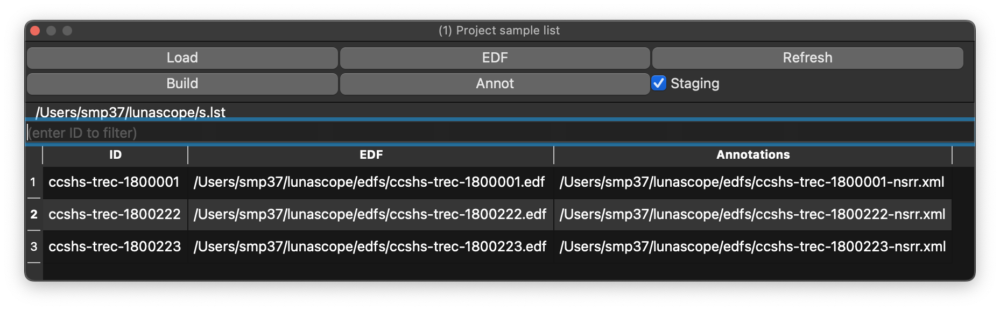

# Loading Data / Sample Lists

## Inputs

The Project dock supports several ways of loading EDF and annotation data:

 - _Load_ loads a sample list.
 - _Build_ creates a sample list from a folder by finding EDFs and pairing matching annotation files, including `.annot`, `.xml`, `.eannot`, and `.tsv` when present.
 - _EDF_ loads a single EDF.
 - _Annot_ loads a single annotation file without signal data; the file picker accepts `.annot`, `.eannot`, `.xml`, `.tsv`, and `.txt`.
 - _Refresh_ reloads the attached record and discards temporary changes such as masking or filtering.

## Tutorial data

The _Project_ menu also includes _Download Tutorial..._. This downloads the Luna tutorial dataset as a `.zip`, extracts it into a folder you choose, and then tries to load the included `s.lst` sample list automatically.

This is a convenient way to get a known working example project into Lunascope without building your own sample list first.

If `tutorial.zip` or an extracted `tutorial/` folder already exists in the selected location, Lunascope asks before overwriting them. The download dialog can also be cancelled while the file transfer is in progress.
 
## Staging

By default, Lunascope warns if no staging information is present, meaning annotations mapped to `N1`, `N2`, `N3`, `R`, `W`, and `?`. If staging is not expected, uncheck _Staging_ to suppress the warning.

## Selecting individuals

If a sample list contains multiple individuals, select the row you want to view. The filter box above the table can be used to narrow the list to a particular ID or recording.
