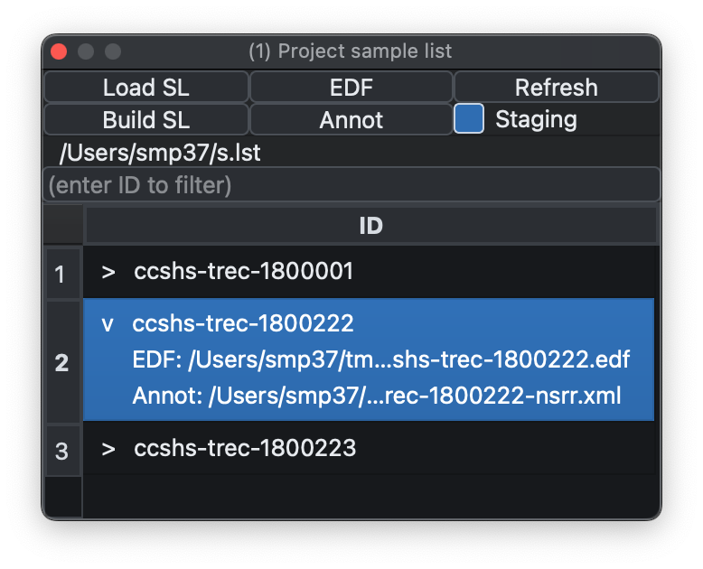
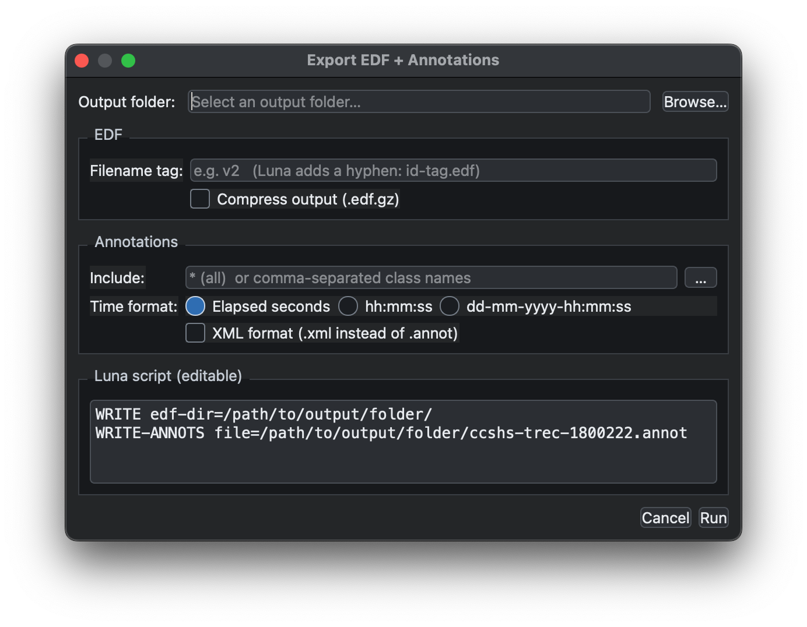

# Loading & Saving Data 

{ width="60%" } 

## Inputs

The Project dock supports several ways of loading EDF and annotation data:

 - ___Load SL___ loads a sample list.
 - ___Build SL___ creates a sample list from a folder by finding EDFs and pairing matching annotation files, including `.annot`, `.xml`, `.eannot`, and `.tsv` when present.
 - ___EDF___ loads a single EDF.
 - ___Annot___ loads a single annotation file without signal data; the file picker accepts `.annot`, `.eannot`, `.xml`, `.tsv`, and `.txt`.
 - ___Refresh___ (`C-L`) reloads the attached record and discards temporary changes such as masking or filtering.

The ___Project___ menu also includes:

  - ___Attach Annotation Folder to S-List___ scans a folder for annotation files and appends matching files onto existing sample-list rows by ID. This is useful when EDFs have already been loaded and annotations arrive later as a separate batch.
 - ___Save S-List___ writes the current sample list to disk, including any internal rows or attached annotation paths added during the current session.
 - ___New Empty EDF___  creates an in-memory blank EDF with a chosen ID, start time, start date, record size, and number of records. It is useful for building or testing annotation-only workflows without starting from an existing EDF file.

## Tutorial data

The ___Project___ menu also includes ___Download Tutorial...___. This
downloads the Luna tutorial dataset as a `.zip`, extracts it into a
folder you choose, and then tries to load the included `s.lst` sample
list automatically.

This is a convenient way to get a known working example project into
Lunascope without building your own sample list first.

If `tutorial.zip` or an extracted `tutorial/` folder already exists in
the selected location, Lunascope asks before overwriting them. The
download dialog can also be cancelled while the file transfer is in
progress.

## Meta-data

The Sample list table can be augmented with key _metadata_ about each
observation (e.g. diagnostic status, age, sex, etc), which is
displayed when that observation is selected.  Metadata does not play
any other role within Lunascope/Luna, i.e. beyond simply being displayed
in the sample list dock.

The ___Project___ menu has two options for metadata:

  - ___Load Metadata File...___ loads a TSV (default extension `.tsv` or `.meta`) that assumes `ID` is the first column

  - ___Clear Metadata___ clears any currently attached metadata

When loading a sample list named `s.lst`, for example, if a file
`s.meta` exists in the same folder, it will be automatically attached
as metadata.

## Staging

By default, Lunascope warns if no staging information is present,
meaning annotations mapped to `N1`, `N2`, `N3`, `R`, `W`, and `?`. If
staging is not expected, uncheck ___Staging___ to suppress the
warning.

## Selecting individuals

If a sample list contains multiple individuals, select the row you
want to view. The filter box above the table can be used to narrow the
list to a particular ID or recording.

## Exporting data

The ___Project___ main menu has an option to ___Export EDF + Annotations___.
Selecting that brings up this dialog:

It is essentially a wrapper around two Luna commands (`WRITE` and
`WRITE-ANNOTS`) to save the current, potentially modified, version of
the EDF together with all attached annotations, either as a single
unified Luna-formatted file or as XML annotation output.

---

Previous: [Overview](overview.md) | Next: [Viewer](signal-viewer.md)
