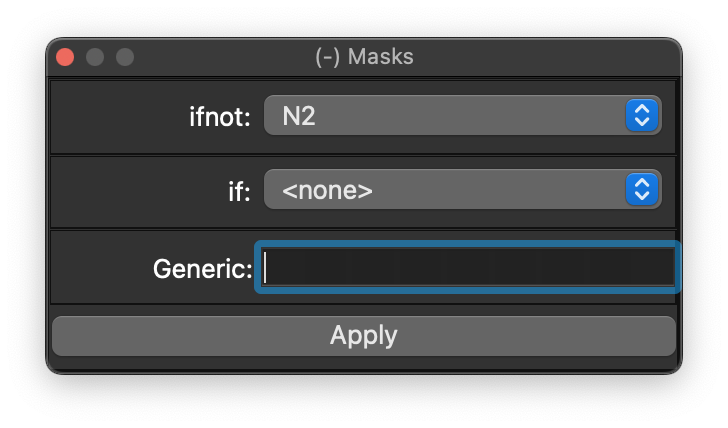

# Masks

The Masks dock applies simple epoch-level masks to the currently attached recording.

{ width="60%" }

It exposes two common mask styles: exclude epochs that do not match an annotation (`ifnot`) or exclude epochs that do match (`if`). You can also enter more general masks using the same syntax as Luna's [`MASK`](https://zzz.nyspi.org/luna/ref/masks/) command.

The same operation can be done from the [Luna script console](scripts.md) with `MASK`; this dock is just the simpler GUI form.
