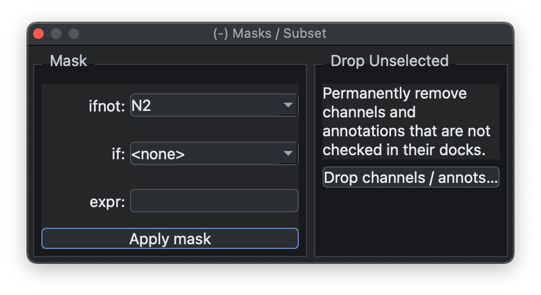
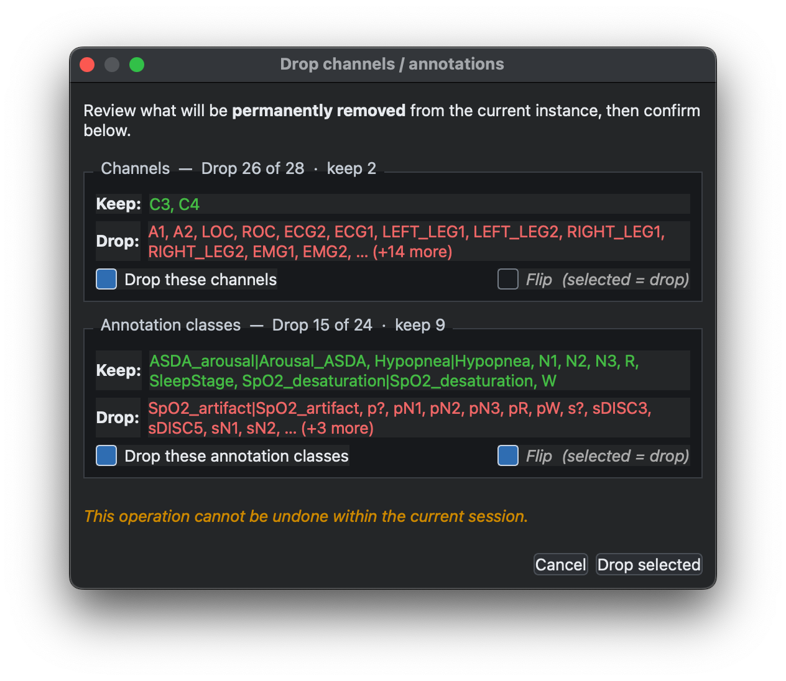

# Masks & Subsets

The Masks / Subset dock applies simple epoch-level masks to the
currently attached recording, as well as allowing for lists of channels and/or annotations to be dropped
from the in-memory data.

## Masks

{ width="60%" }

It exposes two common mask styles: exclude epochs that do not match an
annotation (`ifnot`) or exclude epochs that do match (`if`). You can
also enter more general masks using the same syntax as Luna's
[`MASK`](https://zzz.nyspi.org/luna/ref/masks/) command.

The same operation can be done from the [Luna script
console](scripts.md) with `MASK`; this dock is just the simpler GUI
form.

## Subsets

The same dock can also remove selected channels or annotation classes from
the current in-memory record. This is useful for hiding signals that are not
needed for the current analysis, or for simplifying the annotation list before
viewing, masking, or scripting.

Choose the channels or annotation classes to drop, then use the confirmation
window to review what will be kept and removed. The `Flip` option inverts the
selection, so the currently selected items are kept and the unselected items
are dropped instead. After confirming with `Drop selected`, the removed items
are no longer available in the current session; reload the record to restore
the original channel and annotation lists.

{ width="80%" }

---

Previous: [Hypnograms](hypnograms.md) | Next: [Parameters](parameters.md)
