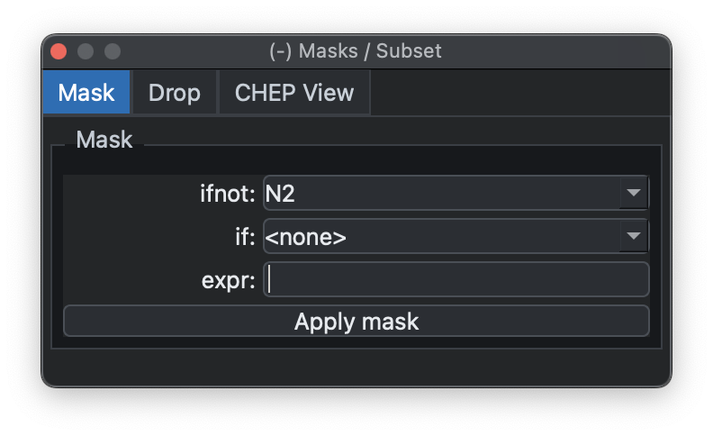
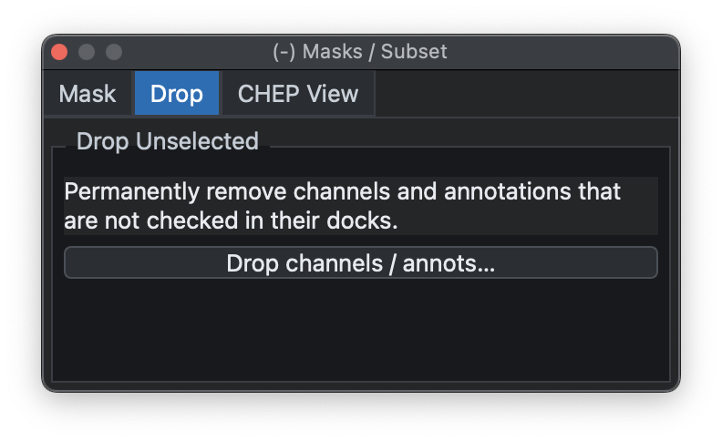
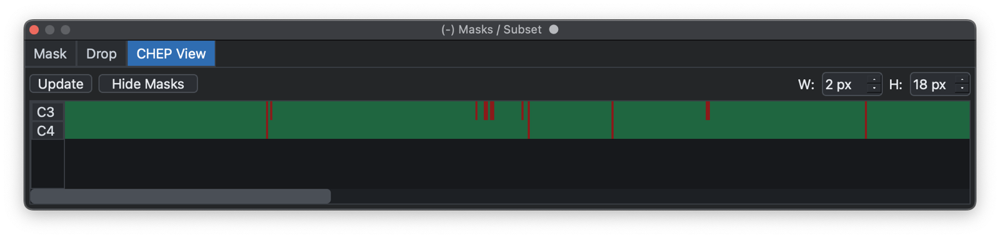
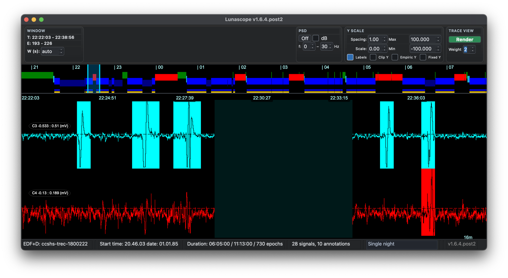

# Masks & Subsets

The Masks / Subset dock applies simple epoch-level masks to the
currently attached recording, allows lists of channels and/or annotations
to be dropped from the in-memory data, and provides a CHEP View tab for
working with channel-by-epoch artifact masks.

## Masks

{ width="60%" }

It exposes two common mask styles: exclude epochs that do not match an
annotation (`ifnot`) or exclude epochs that do match (`if`). You can
also enter more general masks using the same syntax as Luna's
[`MASK`](https://zzz.nyspi.org/luna/ref/masks/) command.

The same operation can be done from the [Luna script
console](scripts.md) with `MASK`; this dock is just the simpler GUI
form.

## Subsets

{ width="60%" }

The same dock can also remove selected channels or annotation classes from
the current in-memory record. This is useful for hiding signals that are not
needed for the current analysis, or for simplifying the annotation list before
viewing, masking, or scripting.

{ width="90%" }

Choose the channels or annotation classes to drop, then use the confirmation
window to review what will be kept and removed. The `Flip` option inverts the
selection, so the currently selected items are kept and the unselected items
are dropped instead. After confirming with `Drop selected`, the removed items
are no longer available in the current session; reload the record to restore
the original channel and annotation lists.

## Artifacts

The _Masks / Subset_ dock also contains a _CHEP View_ tab for inspecting
channel-by-epoch artifact masks. These masks are controlled by Luna's
[`CHEP-MASK`](https://zzz-luna.org/luna/ref/artifacts/#chep-mask) command and
reported by [`CHEP`](https://zzz-luna.org/luna/ref/artifacts/). This view is
primarily useful for high-density EEG, where channel-specific artifacts can be
hard to review from annotation lists alone.

Use _Update_ to run a CHEP dump for the attached recording and refresh the
matrix. Rows are the currently selected channels from the _Signals_ dock and
columns are epochs. The summary line reports the number of epochs, channels,
CHEP-flagged cells, and epochs removed by the current epoch mask. The `W` and
`H` controls adjust the epoch-column width and channel-row height.

{ width="100%" }

Use _Show Masks_ to overlay the CHEP and epoch-mask information on the signal
viewer. CHEP-flagged channel bands are highlighted on the relevant signal rows,
and epochs removed by the current epoch mask are shown as dark full-height
bands. The button changes to _Hide Masks_ while the overlay is active.

{ width="100%" }

---

Previous: [Hypnograms](hypnograms.md) | Next: [Parameters](parameters.md)
