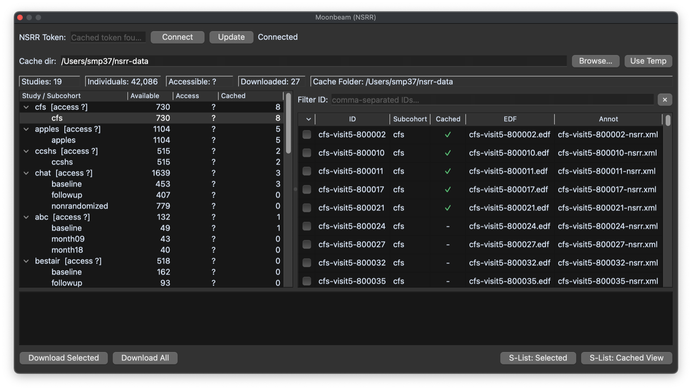

# Moonbeam

_Moonbeam_ is Lunascope's interface to [NSRR](https://sleepdata.org)
downloads. It is designed for browsing available studies, inspecting
accessible individuals, downloading files into a local cache, and
populating a Lunascope sample list from those cached files. Open it
from the _View_ menu or with `Ctrl/Cmd-M`.

## Connecting and cache

Moonbeam requires an NSRR access token. If you do not already have
one, register with NSRR and obtain a token here:
<https://sleepdata.org/token/>. Once the token is entered and
validated, Moonbeam can refresh study access information and manage a
local cache of downloaded EDF and annotation files. Because the cache
can be reused across sessions, it is usually better to choose a
persistent folder rather than a temporary one.

## Browsing and downloading

The main panel combines a study tree, an individual table, an ID
filter, and a download log. The summary bar reports studies,
individuals, accessible records, and downloaded records. From there
you can download selected recordings or whole visible sets, then load
cached recordings into the Project sample list.  This provides a
direct bridge from NSRR browsing into ordinary Lunascope viewing and
scripting.

## Offline behavior

If a manifest is already cached locally, Moonbeam can still populate
its study browser while offline, including the study tree, the
individual table, and S-List population from cached files. Downloading
new files and refreshing the manifest still require a live connection.

