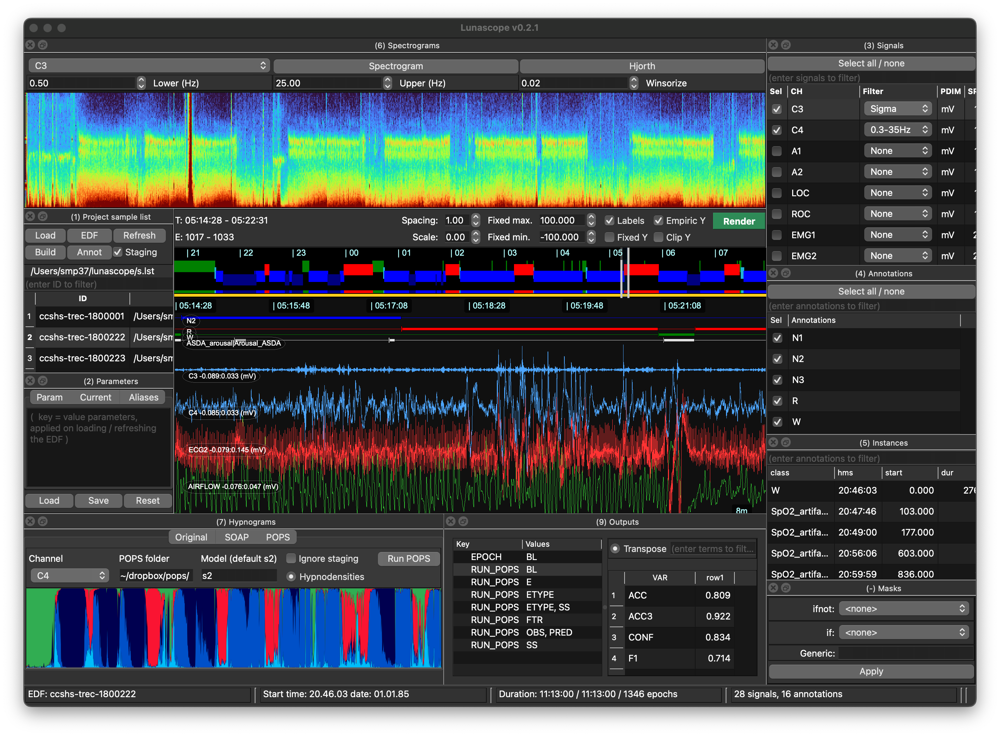

# Overview

Lunascope is organized as a set of synchronized panels, or docks.

The central signal viewer is always present. Other docks can be shown,
hidden, detached, or repositioned to match your workflow, whether from
the menu, by shortcut, or through a [config](config.md) file. There
are also floating docks for [multiday actigraphy](actig.md),
[NSRR/Moonbeam access](moonbeam.md), and the multi-tab
[Explorer](explorer.md).

Lunascope caches the layout of all docks when closing and re-opening.
To quickly return to the default layout, press `C-0` twice.

## Keyboard shortcuts

On Windows and Linux, `C` means the _Control_ key; on macOS, it means _Command_.

| Dock | Shortcut |
|---|---|
| __Signals-only / default layout__ | `C-0` |
| [Sample lists](loading.md) | `C-1` |
| [Parameters](parameters.md) | `C-2` |
| [Signals](signals.md) | `C-3` |
| [Annotation classes](annotations.md) | `C-4` |
| [Annotation events](annotations.md) | `C-5` |
| [Spectrograms](spectrograms.md) | `C-6` |
| [Hypnograms / actigraphy](hypnograms.md) * | `C-7` |
| [Luna script console](scripts.md) | `C-8` |
| [Output tables](scripts.md) | `C-9` |
| [Masks](masks.md) | `C--` |
| [Command help](commands.md) | `C-/` |
| [Moonbeam](moonbeam.md) | `C-M` |
| [Explorer](explorer.md) | `C-E` |

`*` when multiday mode is detected, `C-7` switches from the hypnogram dock to the actigraphy dock.

`C-0` toggles between the normal multi-dock workspace and a stripped-down signals-only layout for focused viewing.
