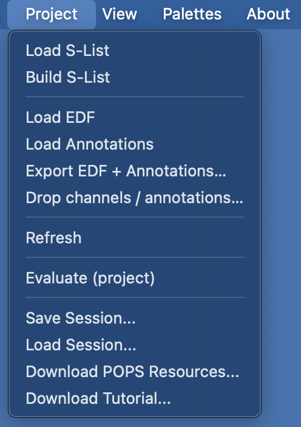
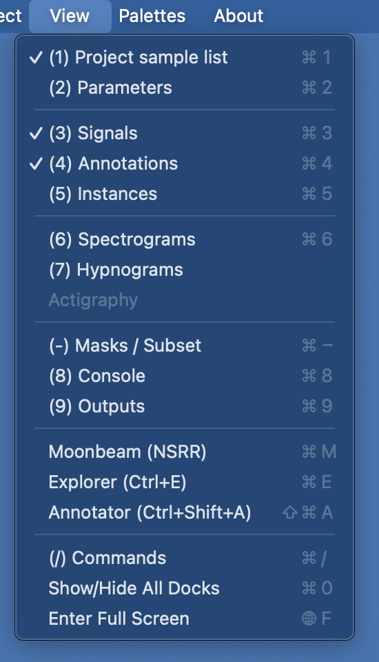

# Overview

Lunascope is organized as a set of synchronized panels, or docks.

The central signal viewer is always present. Other docks can be shown,
closed, detached, or repositioned to match your workflow, whether from
the menu, by shortcut, or through a [config](config.md) file. There
are also floating docks for [multiday actigraphy](actig.md),
[NSRR/Moonbeam access](moonbeam.md), and the multi-tab
[Explorer](explorer.md).

Lunascope caches the layout of all docks when closing and re-opening.
To quickly return to the default layout, press `C-0` twice.

## Main menu

Lunascope has a main menu with four tabs: ___Project___, ___Views___, ___Palettes___ and ___About___.

The ___Project___ menu contains the main file and session actions:
loading EDFs, [annotations](annotations.md), or [sample lists](loading.md);
exporting or dropping data; refreshing the current record; running
project-level evaluation; and saving or restoring [sessions](sessions.md).
It also includes shortcuts for downloading POPS resources and the
tutorial dataset.

{ width=35% }

The ___Views___ menu shows or hides individual docks, indicates which
ones are currently open, and lists the associated keyboard shortcuts.
It also provides access to [Moonbeam](moonbeam.md),
[Explorer](explorer.md), [Annotator](annotations.md), the
[command help](commands.md) dock, a global show/hide toggle for all
docks, and fullscreen mode.

{ width=35% }

## Keyboard shortcuts

On Windows and Linux, `C` means the _Control_ key; on macOS, it means _Command_.

| Dock | Shortcut |
|---|---|
| Reset layout | `C-R` |
| [Sample lists](loading.md) | `C-1` |
| [Parameters](parameters.md) | `C-2` |
| [Signals](signals.md) | `C-3` |
| [Annotation classes](annotations.md) | `C-4` |
| [Annotation events](annotations.md) | `C-5` |
| [Spectrograms](spectrograms.md) | `C-6` |
| [Hypnograms / actigraphy](hypnograms.md) * | `C-7` |
| [Luna script console](scripts.md) | `C-8` |
| [Output tables](scripts.md) | `C-9` |
| [Masks](masks.md) | `C--` |
| [Command help](commands.md) | `C-/` |
| Toggle signals-only / all-docks | `C-0` |
| | |
| __Special modules__ | |
| Toggle [Explorer](explorer.md) on/off | `C-E` |
| Toggle [Annotator](annotations.md) on/off | `C-Shift-A` |
| Toggle [Moonbeam](moonbeam.md) on/off | `C-M` |
| Cycle modules | <code>C-`</code> |
| | |
| __Viewing options__ | |
| Increase UI font size | `C-Shift-=` |
| Decrease UI font size | `C-Shift--` |
| Reset UI font size | `C-Shift-R` |
| | |
| __Other functions__ | |
| Refresh (reLoad) attached EDF | `C-L` |
| Execute console [Luna script](scripts.md) for attached EDF | `C-RET` |
| Execute console [Luna script](scripts.md) across all EDFs | `C-Shift-RET` |

`*` when multiday mode is detected, `C-7` switches from the hypnogram dock to the actigraphy dock.

---

Previous: [Installation](install.md) | Next: [Loading/Saving Data](loading.md)
