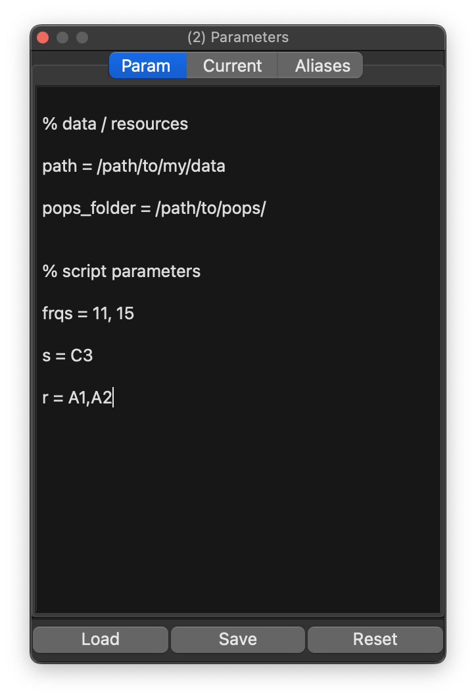
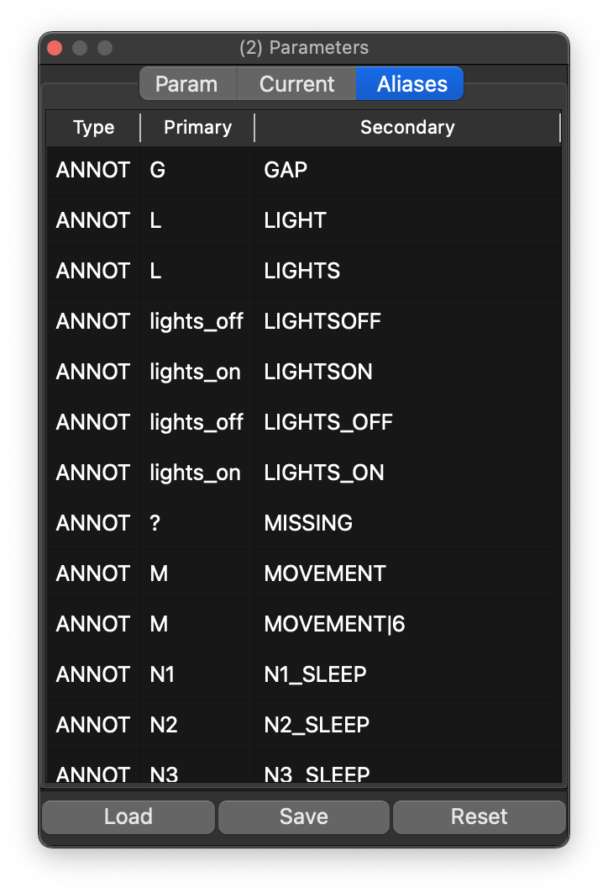

# Parameters

The _Parameters_ dock is used for passing [special variables](https://zzz-luna.org/luna/luna/args/#special-variables) that are applied:

 - when first attaching a new individual's data

 - when hitting _Refresh_ (to reload the individual's data anew) 

 - when executing a Luna script

_Parameters (Luna) versus configurations (Lunascope)_: the _Param_ tab passes instructions to Luna itself, whereas the [_Config_](config.md) tab controls Lunascope-specific display behavior.

{ width="50%" }

Some parameters are needed before data can even be attached. For example, if annotations use a nonstandard YMD date format, add `date-format=YMD`; otherwise loading may fail. This is equivalent to the options that come before the main Luna script:

```
luna s.lst 1 date-format=YMD th=2.5 @param.txt -o out.db < script.txt
```
In this example, `date-format` is a [special variable](https://zzz-luna.org/luna/luna/args/#special-variables) that controls Luna's behavior, `th` is a user-defined variable required by `script.txt`, and `@param.txt` includes additional parameter values that would be loaded into this dock.


## Aliases and remapping

One common use of parameter files is to rename signals (`alias`) and annotations (`remap`). If these are defined at load time, the Signals and Annotations docks show the mapped labels rather than the originals.

By default, Luna includes some built-in mappings unless `annot-remap=F` and/or `nsrr-remap=F` is set. The Parameters tab can also be used to inspect the currently defined variables and signal/annotation mappings.

{ width="50%" } 

## Loading parameter files

You can pre-load a parameter file from the command line with `-p`:

```
lunascope s.lst -p param.txt
```
This pre-populates the dock with that file.
