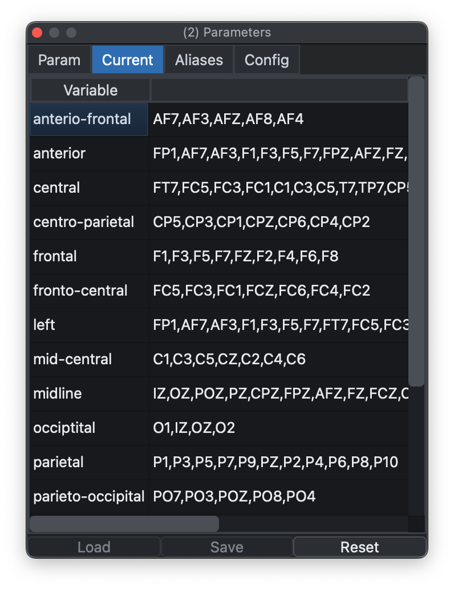
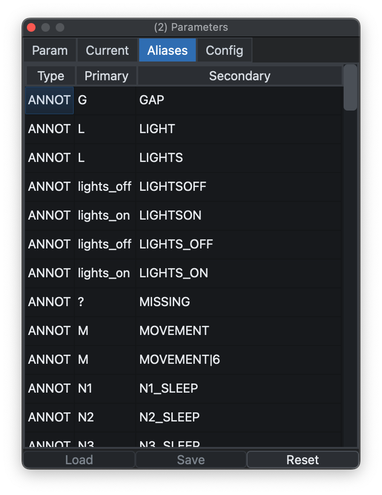
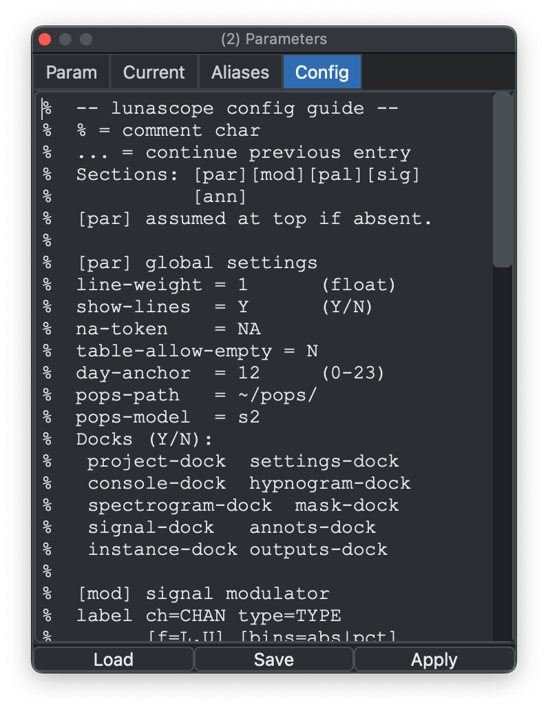

# Parameters

This dock 1) specifies variable definitions and special instructions ([parameters](#parameters)) sent to Luna,
2) keeps track of the [currently defined variables](#current-variables), 3)
lists the currently defined [signal/annotation aliases](#aliases-and-remapping), and 4)
[configuration settings](#configurations) passed to Lunascope, primarily to control display options.


## Parameters

The _Parameters_ dock is used for passing [special variables](https://zzz-luna.org/luna/luna/args/#special-variables) that are applied:

 - when first attaching a new individual's data

 - when hitting _Refresh_ (to reload the individual's data anew) 

 - when executing a Luna script

{ width="50%" }

Some parameters are needed before data can even be attached. For
example, if annotations use a nonstandard YMD date format, add
`date-format=YMD`; otherwise loading may fail. This is equivalent to
the options that come before the main Luna script:

```
luna s.lst 1 date-format=YMD th=2.5 @param.txt -o out.db < script.txt
```

In this example, `date-format` is a [special
variable](https://zzz-luna.org/luna/luna/args/#special-variables) that
controls Luna's behavior, `th` is a user-defined variable required by
`script.txt`, and `@param.txt` includes additional parameter values
that would be loaded into this dock.

You can pre-load a parameter file directly from the command line when starting Lunascope with `-p`:

```
lunascope s.lst -p param.txt
```

This pre-populates the dock with that file.

## Current variables

Currently defined variables are listed in the _Current_ tab:

{ width="50%" }

As well as user-defined variables, this tab may also include some
predefined variables (e.g., `${central}`) that can be
removed with _Reset_. (A variable ${sleep} = `N1,N2,N3,R` will be set by
Luna automatically and always exist.)

## Aliases and remapping

One common use of parameter files is to rename signals (`alias`) and
annotations (`remap`). If these are defined at load time, the Signals
and Annotations docks show the mapped labels rather than the
originals.

By default, Luna includes some built-in mappings unless
`annot-remap=F` and/or `nsrr-remap=F` is set. The _Aliases_ tab can
also be used to inspect the currently defined 
signal/annotation mappings.


{ width="50%" }


## Configurations

_Parameters_ are parsed by Luna, whereas _configurations_ are instructions for Lunascope, to
control its behavior.

{ width="50%" }

See the [configurations page](config.md) for more details.

---

Previous: [Masks](masks.md) | Next: [Luna Scripts](scripts.md)
