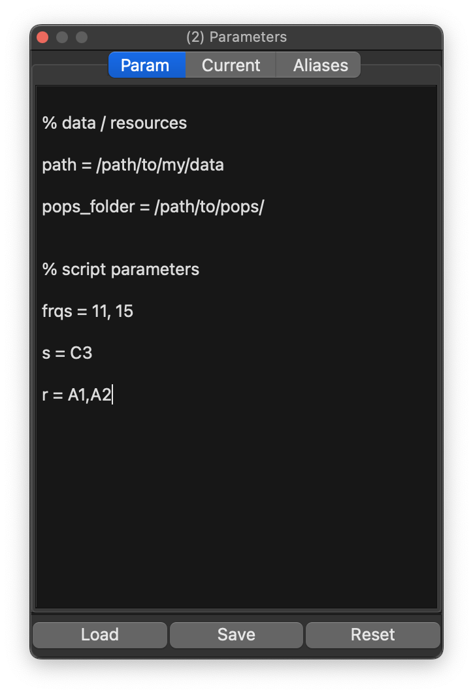

# Luna Scripts

Lunascope can execute **Luna scripts** to automate processing.  These docks are hidden by default, but can be
raised by either the View menu, or Ctrl/Cmd-8 (console dock) and Ctrl/Cmd-9 (output dock).

## A simple script

To apply the `HEADERS` and `STATS` command, i.e. similar to running

```
luna s.lst 1 -o out.db -s ' HEADERS & STATS sig=C3,C4 '
```
enter the script in the console (which can also save/load scripts):


and then press _Execute_.  This will send any output to the output dock.  For example, this table is
the same as the command line

```
destrat out.db +STATS -r CH
```


You can transpose the table for easier viewing, as needed.


__Note:__ future releases of Lunascope will provide support for saving tables or copying to the clip-board.

---

## A more involved case

Here we have an example script to detect NREM spindles and slow oscillations, which takes optional arguments, and adds annotations (reflecting spindle/SO events):


If we load this script and just press _Execute_ we'll get an error message:

{ width="50%" } 

This correctly notes that `${s}` (the signals to use) is required but has not been specified.  These need to be specified in the [parameter](parameters.md) dock (ignore the top examples in this case, but not how variables `${s}`, `${r}` (the reference channels) and `${frqs}` (the spindle frequencies) have been specified: 

{ width="50%" } 

This is now the equivalent to writing
```
luna s.lst 1 -o out.db s=C3 r=A1,A2 frqs=11,15 < spindle.txt
```
(assuming the Luna script is called `spindle.txt`).

Now it should run properly (i.e. assuming channels `C3`, `A1` and `A2` exist, and there are NREM annotations) and give output as follows: here it shows spindle metrics for fast and slow (`F` = 15 and 11 Hz) for two channels (here, `s=C3,C4` obviously, rather than a single channel):


Inspecting the script, we see it will generate annotations (`SP11` and `SP15` as well as `SO`) marking where detected spindles occur.   After running the script, these will be attached to the in-memory instance, and can be viewed (or used in any subsequent Luna command, until _Refresh_ is hit or a new EDF loaded):

{ width="60%"}

Selecting the two EEG channels -- and applying sigma-filtering on one of them -- as well as the relevant annotations, you can explore the detected NREM transient events in this dataset:


