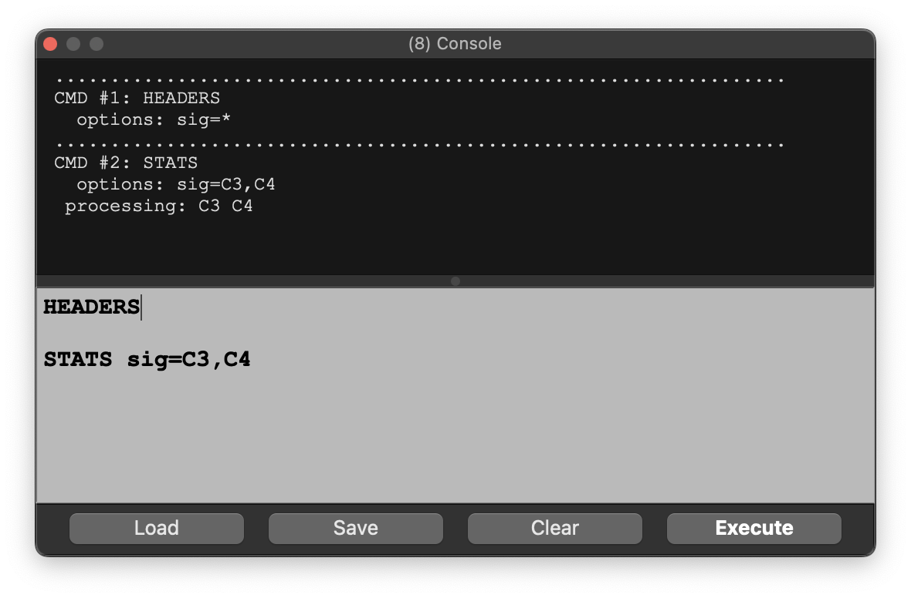
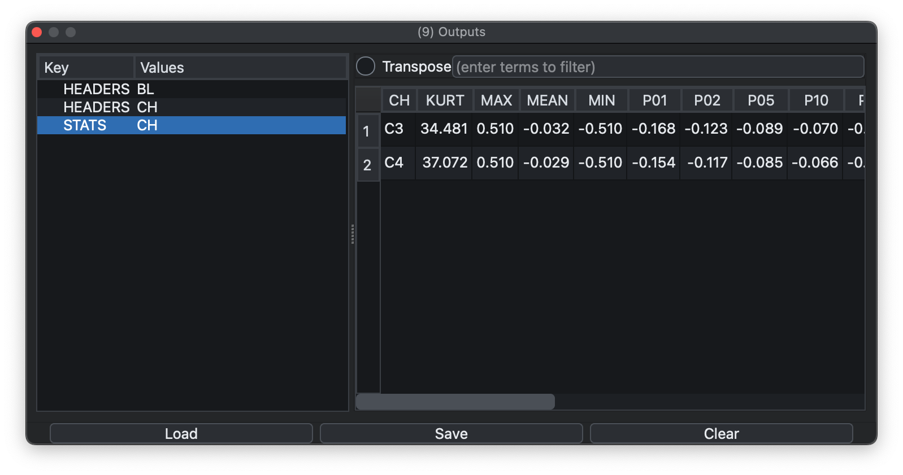
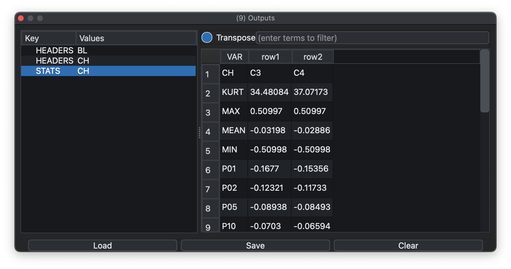
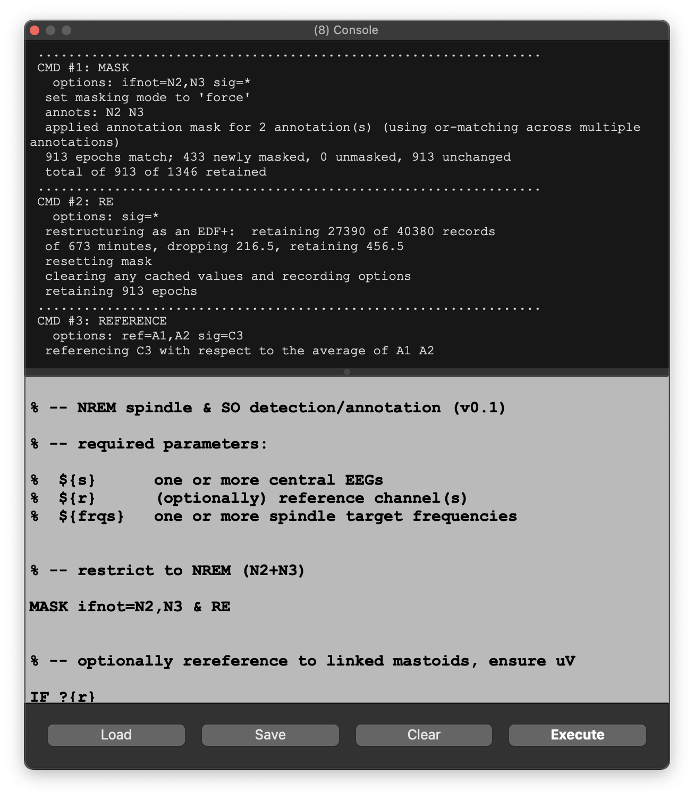
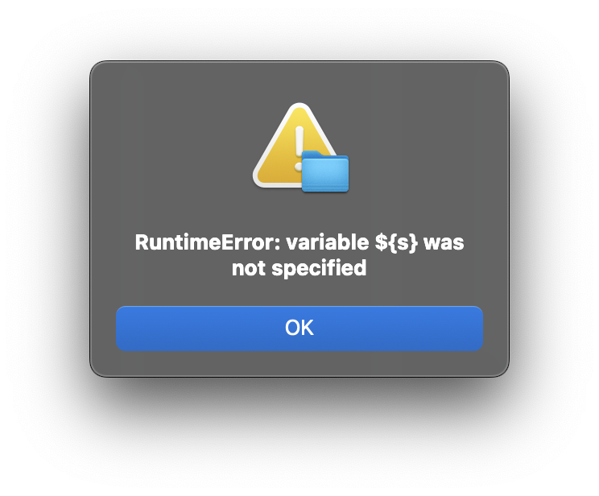
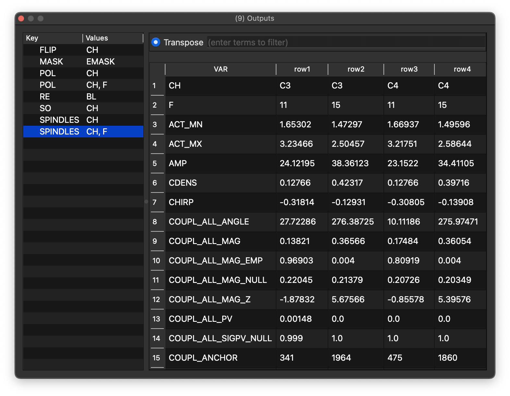
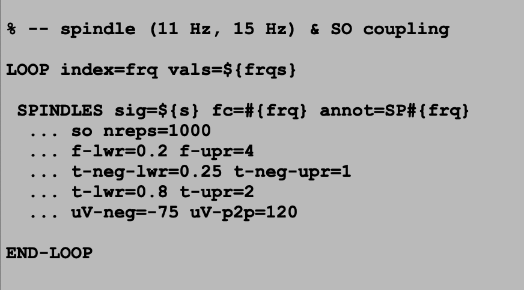
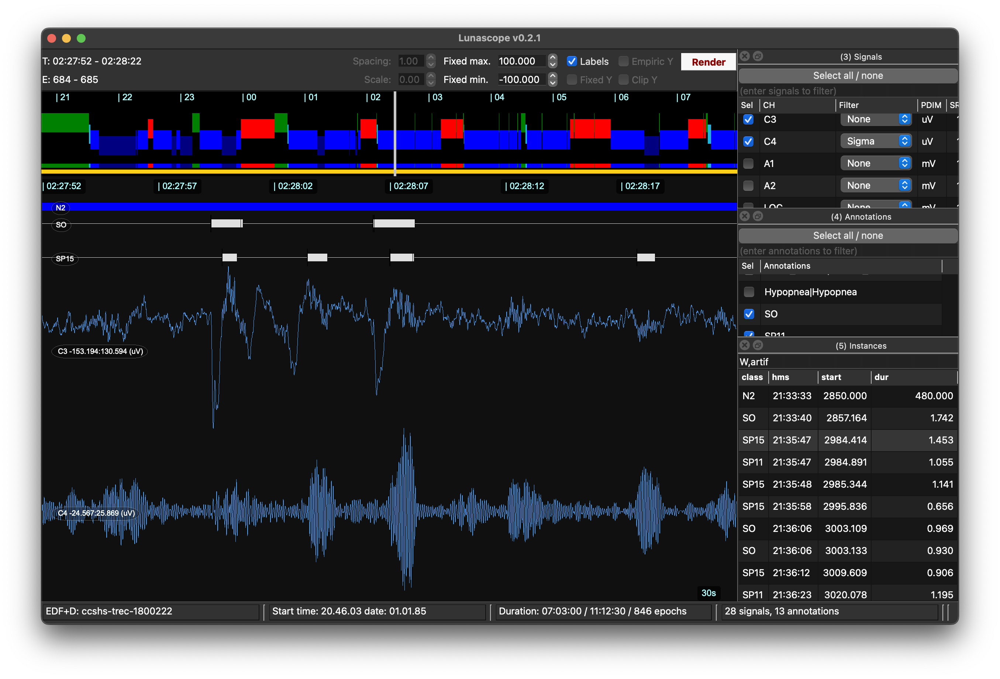
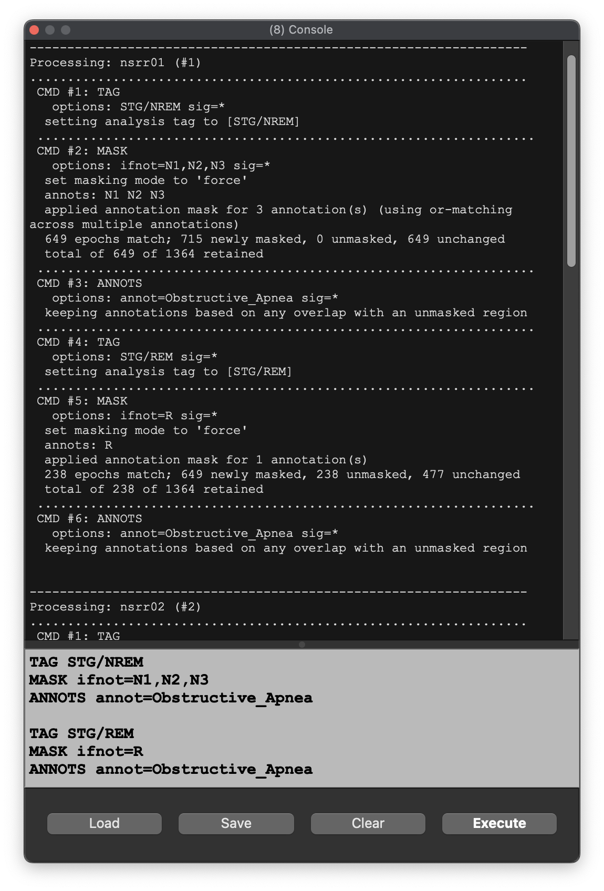
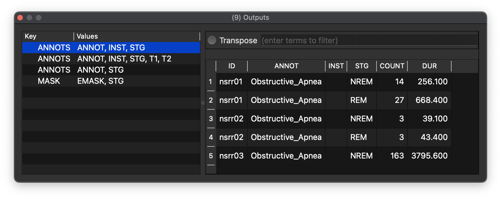

# Luna Scripts

Lunascope can execute [**Luna scripts**](https://zzz.nyspi.org/luna/luna/args/) for multi-step, automated processing. The
console and output docks are hidden by default, but can be opened from
the View menu or with `Ctrl/Cmd-8` and `Ctrl/Cmd-9`.

## Script & console dock

To apply `HEADERS` and `STATS`, similar to running

```
luna s.lst 1 -o out.db -s ' HEADERS & STATS sig=C3,C4 '
```
enter the script in the console:



The lower half of this window is for input, and any log output is recorded in the top half after the script is run.

## Output dock

After _Execute_, the returned tables appear in the Outputs dock. For example, this table corresponds to:

```
destrat out.db +STATS -r CH
```



Tables can be transposed if that makes them easier to read.  Hovering
over output-table column headers will also try to show the Luna
variable description for that field.




### Exporting tables

Selected cells can be copied and the current table can be saved as TSV. Exported tables always include column headers, and if a filter is active only the filtered rows are exported. The _Outputs_ dock can also save, load, or clear the full set of returned tables, not just the current one.

Lunascope can also save the full set of outputs in two formats:

 - `.pkl` : a saved output bundle containing the output tables and table tree
 - `.zip` : a zip archive containing one `.tsv` file per table plus a `_manifest.tsv`

It can also load previously saved outputs:

 - `.pkl` output bundles

 - `.zip` output bundles

 - Luna `.db` databases (i.e. output created by Luna)

Loading a Luna `.db` is useful when results were generated outside the current Lunascope session, for example by command-line Luna.  Note that
this interactive table browser is _not_ necessarily designed for very large outputs (e.g., thousands of variables/strata on hundreds or thousands of recordings).


---

## A more involved case

Here is a script that detects NREM spindles and slow oscillations. It
takes optional arguments and adds annotations for the detected events:



If we load this script and just press _Execute_, we'll get an error message:

{ width="50%" } 

This correctly notes that `${s}` is required but has not been specified. These values belong in the [Parameters](parameters.md) dock. In this example `${s}`, `${r}` (reference channels), and `${frqs}` (spindle frequencies) are defined there:

{ width="50%" } 

This is now the equivalent to writing
```
luna s.lst 1 -o out.db s=C3 r=A1,A2 frqs=11,15 < spindle.txt
```
(assuming the Luna script is called `spindle.txt`).

Now it should run properly, assuming the channels exist and NREM annotations are present. Here it shows spindle metrics for fast and slow spindles (`F` = 15 and 11 Hz) across two channels:



The script also generates annotations (`SP11`, `SP15`, and `SO`) marking where detected events occur. These remain attached to the current in-memory record until _Refresh_ is used or a new EDF is loaded:

{ width="60%"}

With the relevant EEG channels and annotations selected, those detected
events can then be explored in the viewer:




## Batch processing

Lunascope is built primarily for interactive review of a single record, but it can also apply a script across the current sample list.

_For non-trivial batch processing, it is typically better to use command-line Luna instead of the interactive viewer._

A batch job in Lunascope applies the current Luna script to all
samples in the current sample list, iteratively. For example, this
script enumerates the number of NREM and REM obstructive apnea events:

```
TAG STG/NREM
MASK ifnot=N1,N2,N3 
ANNOTS annot=Obstructive_Apnea

TAG STG/REM
MASK ifnot=R 
ANNOTS annot=Obstructive_Apnea
```

Instead of _Execute_ (`C-RET`), use _Project / Evaluate (project)_ (or `C-Shift-RET`):

{ width="40%" }

This opens a small configuration dialog where you choose the number of worker processes, then loads records across those workers, runs the job, and collates the output. Progress is shown in the status bar and the console updates as records finish:

{ width="70%" }

When finished, the final record is detached and the outputs are collated and displayed together, with an `ID` column added to each table so you can see which individual produced which row:

{ width="100%" }

Lunascope processes project jobs in parallel worker processes when more than one worker is selected, and the GUI remains responsive while they run. You can request cancellation with _Project / Evaluate (project)_ again or press `Ctrl/Cmd-.`; queued records are stopped while any in-progress worker slice is allowed to finish or shut down cleanly. Lunascope also does not automatically save all outputs, so this is still best kept for light project-level jobs rather than serious batch pipelines.

---

Previous: [Parameters](parameters.md) | Next: [Moonbeam](moonbeam.md)
