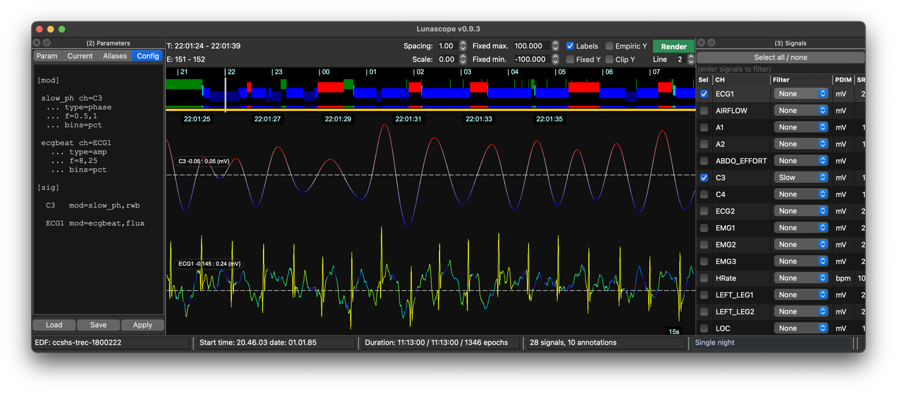
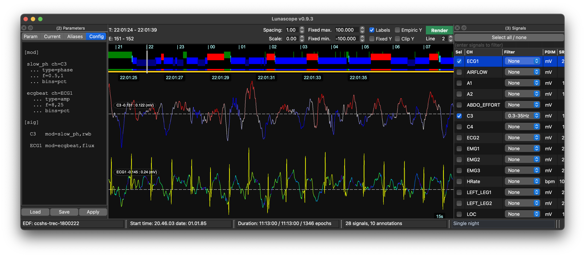

# Signal modulation

_Signal modulation_, or `sigmod`, is an advanced, experimental
render-only display feature that adds a color-coded overlay to a
rendered trace based on a derived property of that signal. The
original waveform remains visible, so `sigmod` acts as an extra visual
layer rather than a separate plot.

For example, here we set the top EEG trace ( which is also narrowband
filtered to the 0.5 - 1 Hz range ) to reflect the phase of the same
channel also filtered to the same 0.5 - 1 Hz interval, using a
red-white-blue palette.  Below is an ECG trace, with is colored with
respect to the amplitude of that same ECG between the 8-25 Hz range,
with a different pallete, effectively visually highlighting the R peaks:

A _modulation_ is based on one signal but can be applied to other
signals, or differently filtered versions of the same singal: for
example, here is the same modulation but applied to the 0.3 - 35 Hz
filtered EEG trace - for example, this may provide visual indicators
of spindle-slow oscillation coupling:

Because `sigmod` depends on rendered data, it does not appear in the
simple unrendered view. It is configured through the
[Configuration](config.md) file format using `[mod]`, `[pal]`, and
`mod=...` entries.

## Modulation types

The current modulation types are:

 - `raw` : color the trace from the source signal itself

 - `amp` : color the trace from amplitude-like information, optionally
   in a chosen frequency band

 - `phase` : color the trace from phase-like information, optionally
   in a chosen frequency band

## Why use it

Typical reasons to use `sigmod` are:

 - to make band-limited amplitude changes easier to spot while still viewing the original waveform

 - to visualize phase structure without replacing the trace with a separate plot

 - to highlight only the strongest modulation bins with threshold-like palettes

## Configuration

The conceptual setup is:

1. define one or more `[mod]` entries
2. optionally define a custom `[pal]` palette, or use a built-in palette
3. attach the modulation to a signal in `[sig]` with `mod=<mod_label>,<pal_label>`
4. render the signal view

For the full syntax, built-in palette reference, and examples, see the
[Configuration](config.md) page.

