# Signal Viewer

The central viewer displays synchronized multi-channel PSG signal and annotation data.

## Top panel

<!--
{width="100%"}
-->

{ width="100%" }

The top panel displays:

 - clock times in hourly intervals (24-hour format) across the top

 - a representation of the hypnogram, when staging data are present: NREM, REM, and wake are blue, red, and green respectively

 - a lower representation of the currently included (i.e. _unmasked_) epochs at the bottom

## Pan/zoom navigation

You navigate across signals by clicking on this top panel. The white bar marks the interval shown in the lower panel. Cursor keys can also be used:

 - left/right : move one epoch (30 seconds) backward or forward in time

 - shift + left/right : move multiple epochs backward or forward

 - up/down : zoom in/out to change the span of the lower panel; unless you've _Rendered_ the data (see below), the maximum span is 30 seconds

 - click-and-drag : if you've _rendered_ the data, you can click and drag to select a larger time window; if you double-click within the selected region, it will return to a single-epoch view; you can also resize or drag the selected interval

Zoom and pan controls allow precise inspection of signal segments. For
continuous signals, zooming out eventually switches to a min/max
summary per screen pixel, and at broader spans Lunascope uses an
interquartile-style summary to avoid visual saturation.

## Rendering data

The main panel also includes controls for altering the view, including a _Render_ button.

<!--
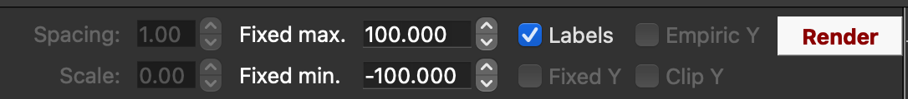{ width="80%" } 
-->

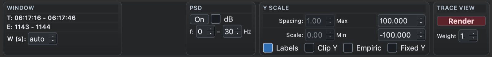{ width="100%" }

The viewer operates in two modes:

 - On first attaching an EDF, Lunascope loads signals directly from
   the in-memory EDF as needed. Signals and annotations can be
   included or excluded through the [Signals](signals.md) and
   [Annotations](annotations.md) docks. In this mode, no more than 30
   seconds of signal data can be viewed at once, although
   annotation-only views are not subject to that limit.

- After pressing _Render_, Lunascope takes a snapshot of the currently
  selected signals and annotations and processes those data for more
  efficient viewing. Subsequent displays come from the rendered cache
  rather than the live in-memory record.

Rendering generates decimated, anti-aliased versions of the data and
supports further downsampling, which makes it practical to view hours
of data without plotting millions of sample points directly.

When _Render_ is clicked, Lunascope keeps the current viewer window
instead of jumping back to the start of the record. The rendered view
is a snapshot of the selected signals and annotations at the time of
rendering. Items selected later are shown as outside the current
rendered snapshot until _Render_ is clicked again.

There are three main advantages to rendering signals:

 - it allows for larger windows to be viewed efficiently

 - it allows for better Y-axis scaling of signals (see below)

 - it precomputes various summary statistics and other things that can
   enhance visualization (although these are not yet included in the
   alpha release of Lunascope)

Three things are worth keeping in mind when using rendering:

 - Rendering speeds up later viewing, but the initial render can take time because the full dataset must be preprocessed, especially for large studies with many channels or high sampling rates.
 - Rendering only includes the currently selected signals and annotations. If you add a new signal or annotation later, render again.
 - If the underlying signal data change, for example through filtering, referencing, or rescaling in the [console](scripts.md), the rendered view does not update automatically. The _Render_ button turns orange after any Luna script to indicate that the rendered cache may be stale.

### Y-scaling

After rendering, the button turns from __white__ to __green__ to indicate that display items are now drawn from the current snapshot. Rendering also allows different y-axis scaling modes:

<!---
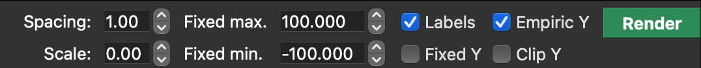{ width="80%" }
--->

 - By default, unrendered signals autoscale within the current view window. As you scroll, the scale can change, and extreme values can flatten the rest of the trace.
 - _Empiric Y_ sets each track to the 10th and 90th percentile after rendering. This fixes the scale and usually makes amplitude changes easier to compare while scrolling, although extreme values can extend beyond the nominal track area.
 - _Clip Y_ prevents that overlap by clipping the signal to the top and bottom of each track.

Examples are these three views for the same interval and set of signals:

Default (autoscaling):

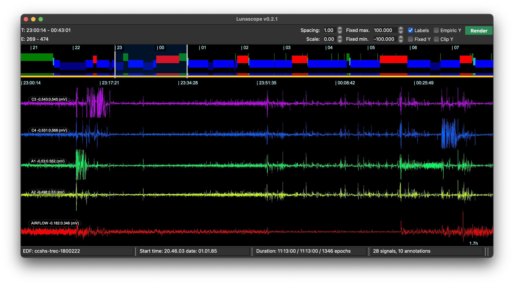

Empiric scaling:

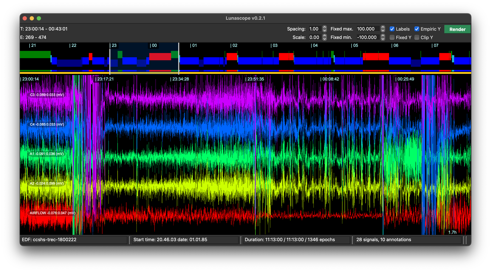

Empiric scaling with clipping:

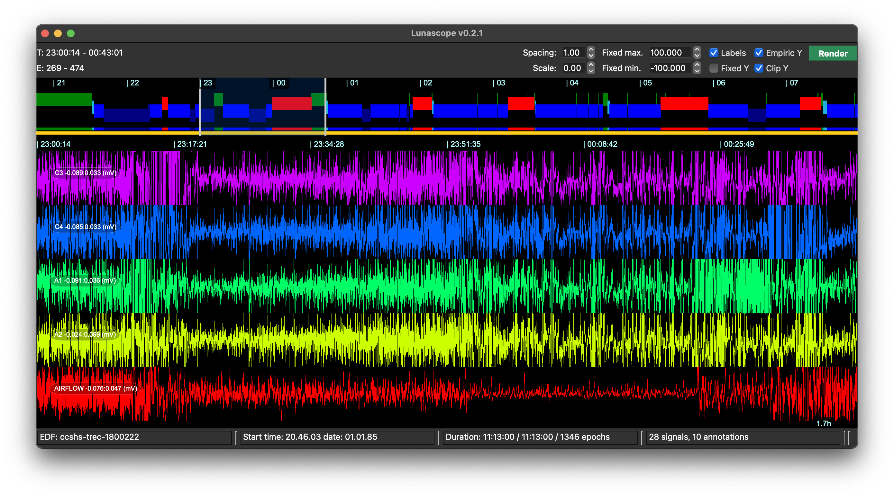

### Line thickness

The _Weight_ control adjusts trace line thickness in the main viewer.

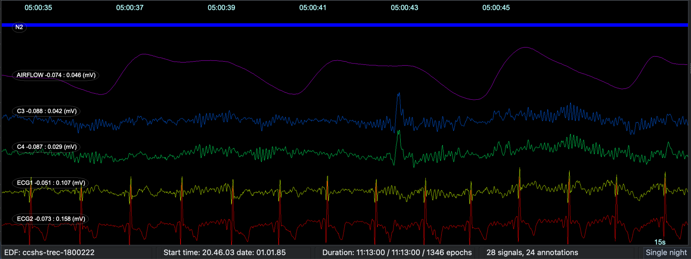

Lower values keep traces fine and unobtrusive, which is often best
when many channels are shown at once, and when you are looking
directly at a high resolution monitor.

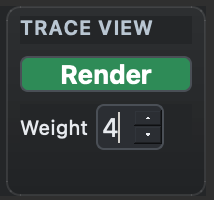{ width="20%" } 

Higher values make individual waveforms stand out more clearly. For example,
instead of the default value of 1, here we set it to 4 (and possibly click ___Render___):

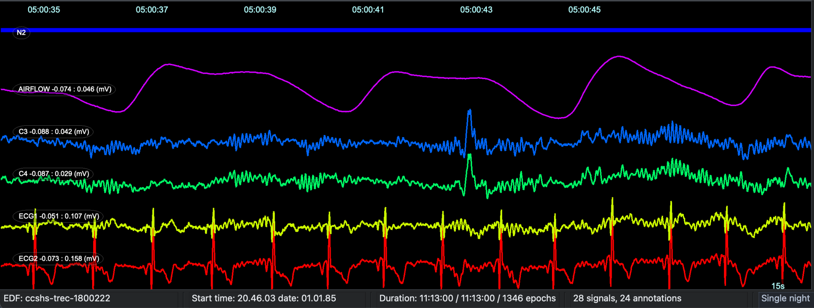

This can be particularly useful for presentations or video
conferencing, e.g. where Zoom etc apply video compression which can
make the default single-pixel traces hard to see.

### Other options

Other viewing options include:

 - show or hide labels for signals and annotations with _Labels_
 - set fixed Y-axis minimum and maximum values with _Fixed Y_; this currently applies to all signals
 - alter spacing and scaling for each signal track
 - change the viewer color scheme from the top Palette menu

An advanced render-only feature is [signal modulation
(`sigmod`)](sigmod.md), which adds color-coded overlays to rendered
traces based on derived signal properties.

## PSD

Lunascope can also display an on-the-fly power spectral density (PSD)
panel for the current signal selection. The PSD controls let you turn
the panel on or off, choose linear or dB scaling, and set the frequency
range to display.

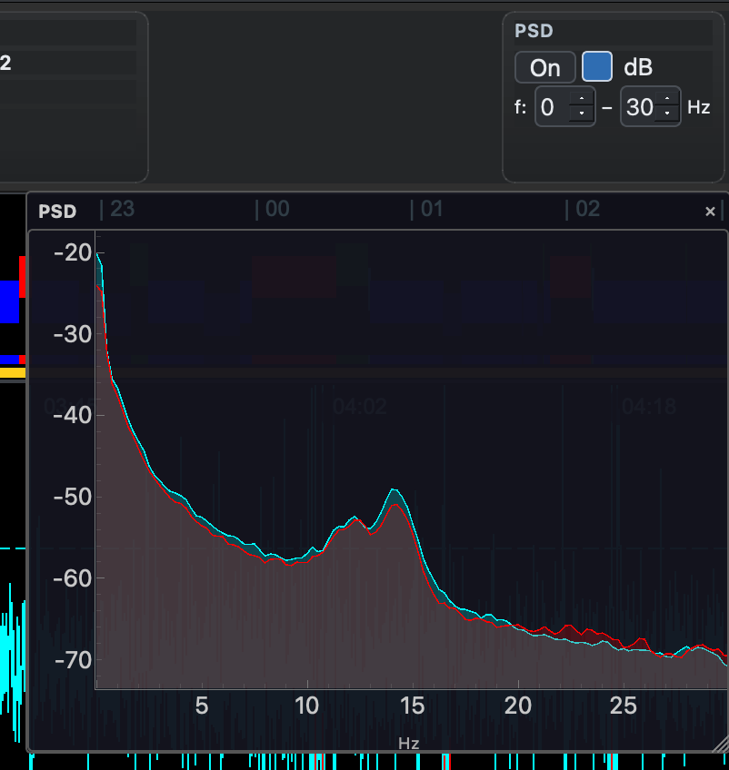{ width="55%" } 

## Measurement probe

In the main signal panel, press and hold the left mouse button to bring
up a temporary measurement probe. This acts like a visual caliper: it
shows the value at the current point, and while you keep dragging within
the same channel it also reports the value difference and elapsed time
between the start point and current point.

While the probe is active, Lunascope can also show extra overlays such
as nearby annotations, peak markers, zero-crossings, simple window
statistics, and optional time grid lines.

The probe shortcuts are shown in the on-screen legend while it is
active. In practice, this means you can keep the basic caliper behavior
simple, then toggle extra overlays only when you need them.

In its simplest form, the probe reports the start value, current value,
their difference, and the elapsed time between the two points.

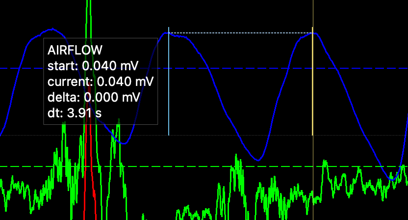{ width="55%" }

With additional overlays enabled, the probe can also show peak and
trough markers, per-window summary statistics, nearby annotations, and
reference grid lines.

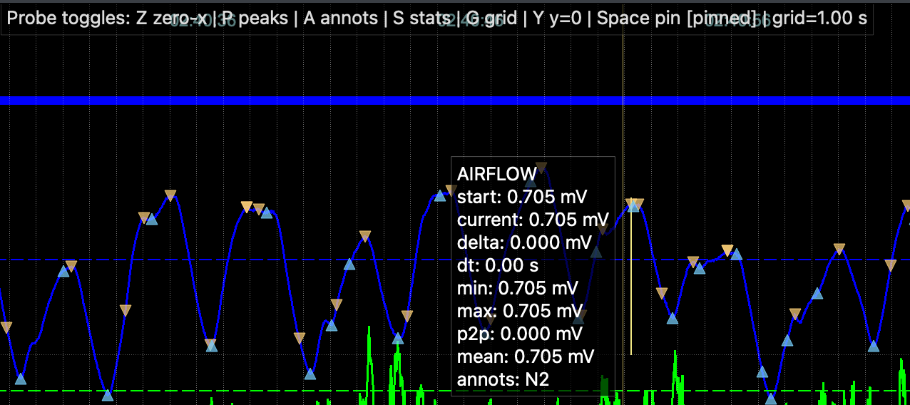{ width="70%" }

---

Previous: [Loading/Saving Data](loading.md) | Next: [Signals](signals.md)
