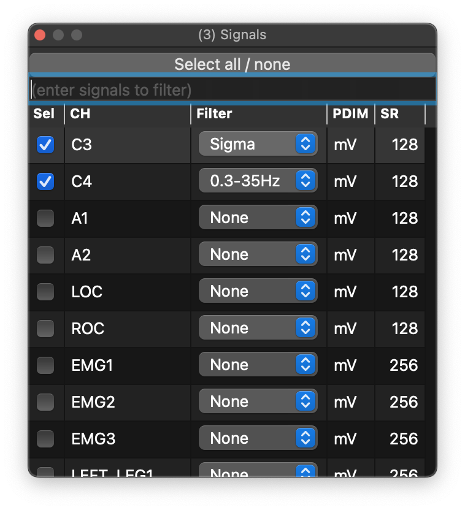

# Signals

The Signals dock controls which channels are visible and which channels
are included when you render the view.

{ width="60%" }

The dock also supports all/none selection, row filtering by comma-delimited channel names, and on-the-fly filtering. The _User_ filter can be defined through a [config file](config.md). `PDIM` shows the physical dimension from the EDF header, `SR` shows the sample rate, and channel order can also be set through a [config file](config.md#examples).
