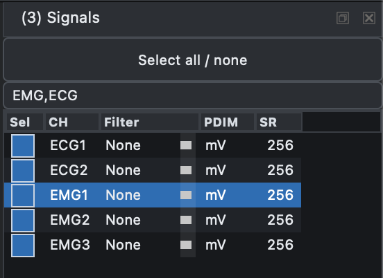
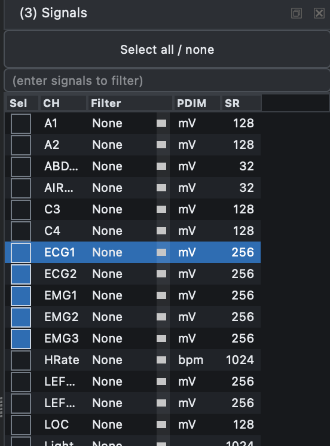

# Signals

The Signals dock controls which channels are visible and which channels
are included when you render the view.

{ width="50%" }

The dock also supports all/none selection, row filtering by comma-delimited channel names, and on-the-fly filtering. The _User_ filter can be defined through a [config file](config.md). `PDIM` shows the physical dimension from the EDF header, `SR` shows the sample rate, and channel order can also be set through a [config file](config.md#examples).

The text box above the table filters the rows shown in the dock. Enter
one or more comma-delimited fragments, such as `EMG,ECG`, to show only
channels whose labels match those fragments.

The _Select all / none_ button applies only to the currently filtered
subset, not to every signal in the recording. This lets you select or
clear whole channel groups by first filtering the table, then toggling
the visible rows.

In rendered mode, channels that were not included in the last _Render_
are shown as not yet rendered rather than displaying a misleading
amplitude range. Click _Render_ again to include newly selected
channels in the rendered cache.

{ width="50%" } 

Here, the filter `EMG,ECG` limits the table to EMG and ECG channels.
Using _Select all / none_ in this filtered view toggles only those five
visible channels. When the filter is cleared, the full channel list
returns, but the selections made within the filtered subset are
preserved.

{ width="50%" } 

---

Previous: [Viewer](signal-viewer.md) | Next: [Annotations](annotations.md)
