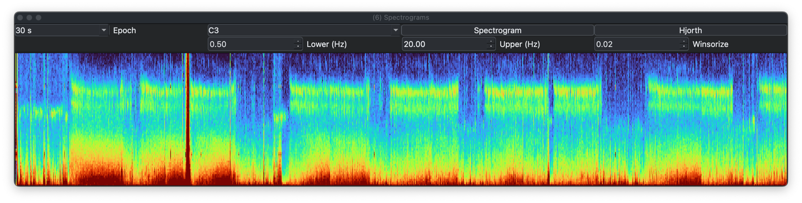
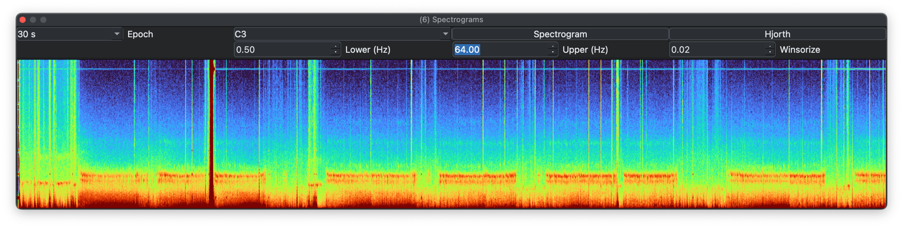
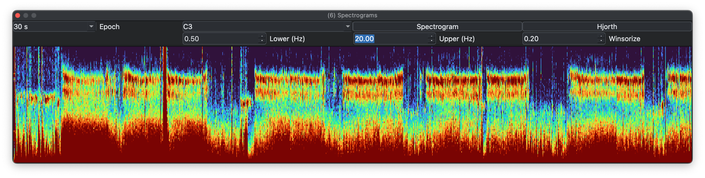
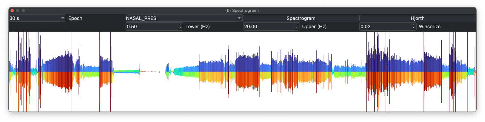
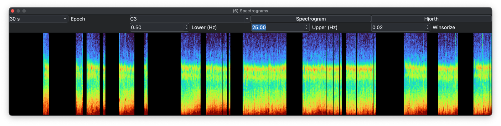

# Spectrograms

The _Time/Frequency_ dock offers Welch spectrograms, Hjorth plots, multitaper spectra, and IRASA.
All methods display how the amplitude and frequency content of a signal changes over time (epochs).

Select a signal from the top-left drop-down (only signals with
sampling rates of 32 Hz or more are listed) and click the run button
for the active tab. Channel labels include sample rate.

## Spectrograms 

### Welch

The Welch spectrogram view uses epoch on the x-axis, frequency (Hz) on
the y-axis, and color to represent spectral power. Epochs
are 30 seconds.

Plots can be copied to the clipboard or saved to a file (right-click).

Frequency ranges are customizable. Here the maximum frequency is raised to 64 Hz (Nyquist):

Sometimes outliers compress the useful dynamic range of the
heatmap. In that case it can help to _winsorize_ the plotted z-values,
meaning clip them to a chosen percentile. Here the same spectrogram is
winsorized at 20% (`0.2`):

Note that after changing the frequency or winsorization options, you
have to re-click _Spectrogram_.

### Multitaper spectrograms 

The _Multitaper_ tab can run either whole-night 30-second epoch
summaries or a zoom mode for the current signal-viewer window. Zoom
mode is limited to short windows and exposes NW, taper count, segment
length, and increment controls. Multitaper spectrograms can be slower to compute
than Welch spectrograms.

### IRASA

The _IRASA_ tab displays either aperiodic or periodic spectral
components from epoch-level IRASA output.   IRASA is slower to compute than a Welch spectogram.

## Hjorth plots

A Hjorth plot is a simpler alternative to a spectrogram. Here the
Y-axis shows magnitude, the first Hjorth parameter, and the top and
bottom colors indicate mobility and complexity:

As a compact representation of signal amplitude and structure, Hjorth
plots can be useful when a conventional spectrogram is less
informative.

## Masked/gapped recordings

If the EDF contains masked epochs, gaps should appear in the plot. Here the display is restricted to N2 epochs only:

---

Previous: [Annotations](annotations.md) | Next: [Hypnograms](hypnograms.md)
