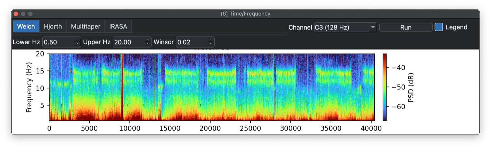
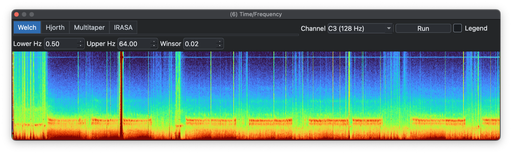
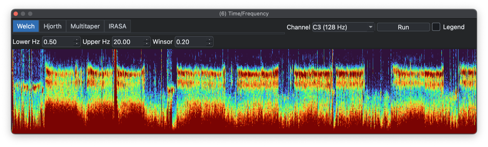
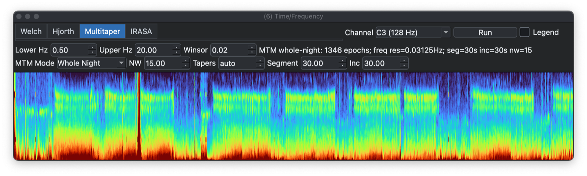
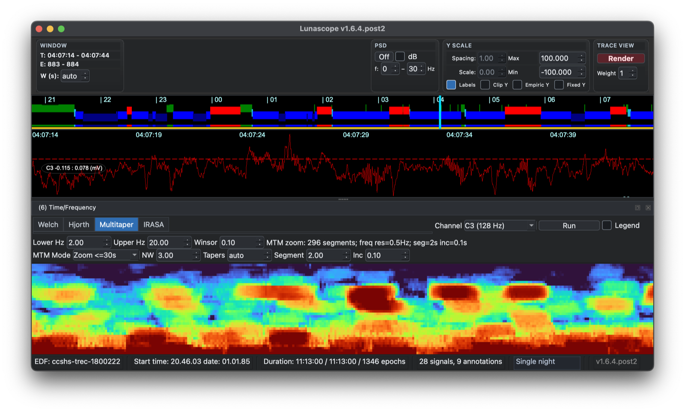
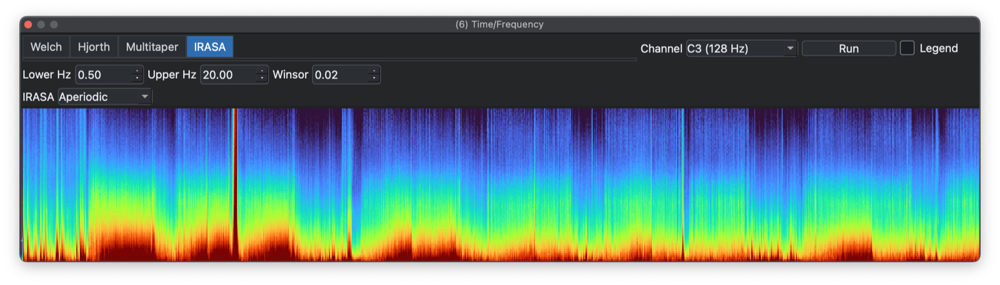
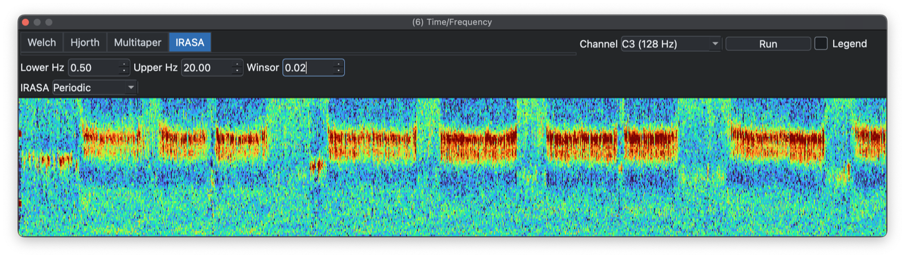
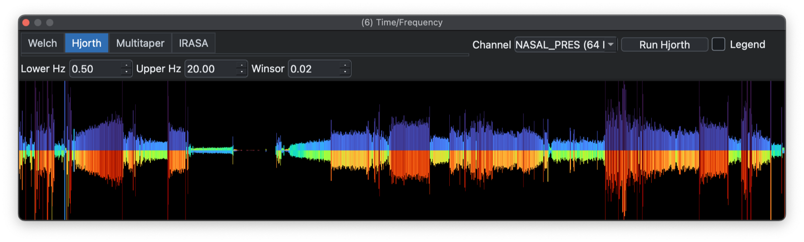
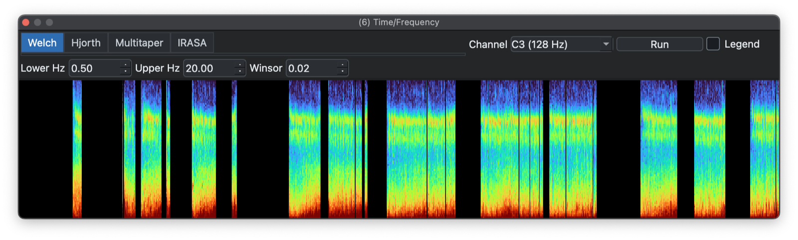

# Spectrograms

The _Time/Frequency_ dock offers Welch spectrograms, Hjorth plots, multitaper spectra, and IRASA.
All methods display how the amplitude and frequency content of a signal changes over time (epochs).

Select a signal from the top-left drop-down (only signals with
sampling rates of 32 Hz or more are listed) and click the run button
for the active tab. Channel labels include sample rate.

## Spectrograms 

### Welch

The Welch spectrogram view uses epoch on the x-axis, frequency (Hz) on
the y-axis, and color to represent spectral power. Epochs
are 30 seconds.

Plots can be copied to the clipboard or saved to a file (right-click).

Clicking _Legend_ toggles between the zoomed-in view with black background, and a version with a full legend.

Frequency ranges are customizable via the _Lower Hz_ and _Upper Hz_
controls. Here the maximum frequency is raised to 64 Hz (Nyquist):

Sometimes outliers compress the useful dynamic range of the
heatmap. In that case it can help to _winsorize_ the plotted z-values,
meaning clip them to a chosen percentile. Here the same spectrogram is
winsorized at 20% (`0.2`):

Note that after changing the frequency or winsorization options, you
have to re-click _Spectrogram_.

### Multitaper spectrograms 

Multitaper spectrogram is a time-frequency method that estimates
signal power using multiple orthogonal tapers instead of a single
window.  Each taper gives a slightly different spectral estimate for
the same time segment.  These estimates are averaged to reduce
variance and spectral leakage.  Compared with Welch, multitaper often
gives smoother, more stable spectra, especially for short or noisy
EEG/PSG segments.  It is useful for robust estimation of oscillatory
power over time, with a tradeoff between frequency resolution and
smoothing.

The _Multitaper_ tab can run either whole-night 30-second epoch
summaries or a zoom mode for the current signal-viewer window. Zoom
mode is limited to short windows and exposes NW, taper count, segment
length, and increment controls. 

Full-night mode multitaper spectrogram:

A <30 second mode spectrogram, which has different default settings controlling temporal and frequency resolution; the
spectrogram is based on the period viewed in the main signal viewer - here we see spindle activity as clear spectral peaks two-thirds up the plot:

Multitaper spectrograms can be slower
to compute than Welch spectrograms.

### IRASA

IRASA is a spectral method that separates aperiodic/fractal 1/f
activity from periodic oscillatory peaks in EEG/PSG signals. It works
by repeatedly resampling the signal by non-integer factors, which
shifts oscillatory peaks but preserves the fractal background.  The
shifted spectra are combined to estimate the aperiodic component.
Subtracting this aperiodic estimate from the original spectrum gives
the oscillatory component.  It is useful for estimating sleep/EEG rhythms
without confounding from changes in broadband spectral slope or
offset.

The _IRASA_ tab displays either aperiodic:

or periodic spectral components from epoch-level IRASA output:  

IRASA is noticeably slower to compute than a Welch spectrogram.

## Hjorth plots

A Hjorth plot is a simpler alternative to a spectrogram. Here the
Y-axis shows magnitude, the first Hjorth parameter, and the top and
bottom colors indicate mobility and complexity:

As a compact representation of signal amplitude and structure, Hjorth
plots can be useful when a conventional spectrogram is less
informative.

## Masked/gapped recordings

If the EDF contains masked epochs, gaps should appear in the plot. Here the display is restricted to N2 epochs only:

---

Previous: [Annotations](annotations.md) | Next: [Hypnograms](hypnograms.md)
