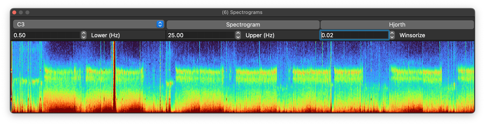
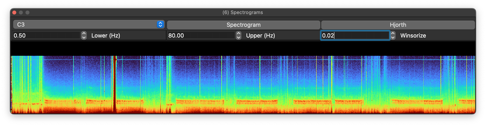
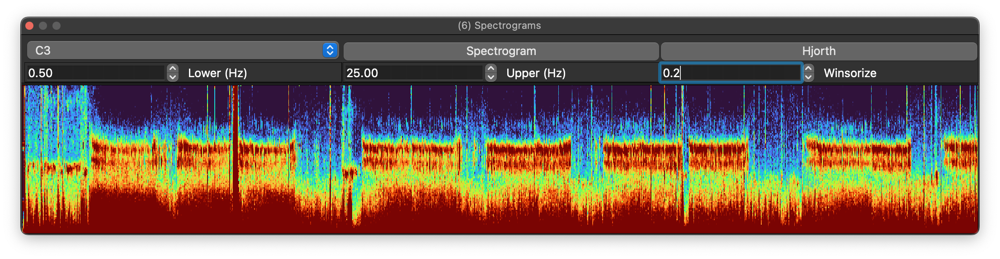
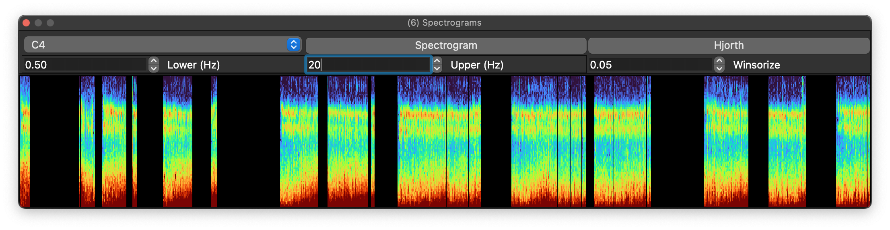
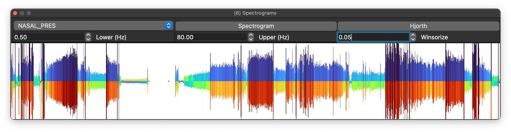

# Spectrograms

Spectrograms display how the frequency content of a signal changes over time.

Select a signal from the top-left drop-down; only signals with
sampling rates of 32 Hz or more are listed. The spectrogram view uses
epoch on the x-axis, frequency (Hz) on the y-axis, and color to
represent spectral power.  By default, epochs are 30 seconds.

Plots can be copied to the clipboard or saved to a file.

## Spectrogram parameters

Frequency ranges are customizable. Here the maximum frequency is raised to 80 Hz:

Sometimes outliers compress the useful dynamic range of the heatmap. In that case it can help to _winsorize_ the plotted z-values, meaning clip them to a chosen percentile. Here the same spectrogram is winsorized at 20% (`0.2`):

## Masked/gapped recordings

If the EDF contains masked epochs, gaps should appear in the plot. Here the display is restricted to N2 epochs only:

## Hjorth plots

A Hjorth plot is a simpler alternative to a spectrogram. Here the Y-axis shows magnitude, the first Hjorth parameter, and the top and bottom colors indicate mobility and complexity:

As a compact representation of signal amplitude and structure, Hjorth plots can be useful when a conventional spectrogram is less informative.
